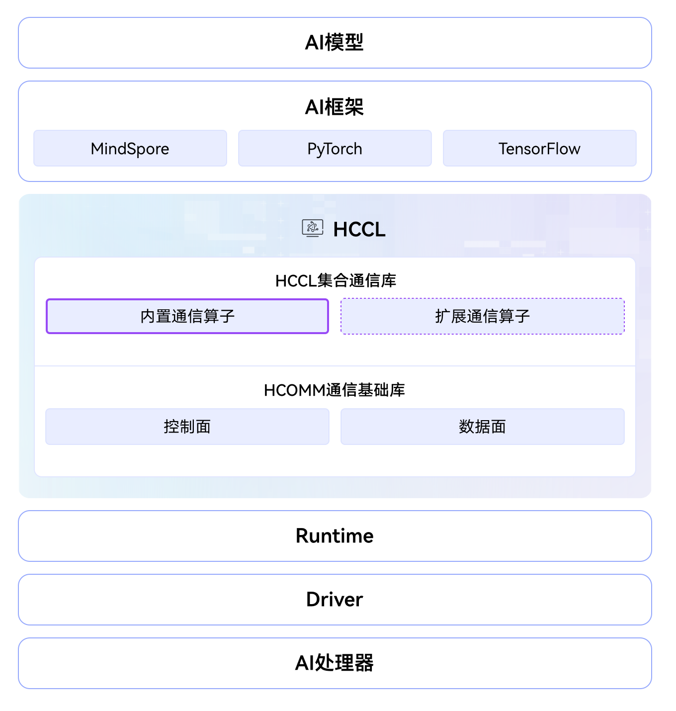

# HCCL

## 🔥Latest News

- [2025/11/30] HCCL项目正式开源。

## 🚀 概述

集合通信库（Huawei Collective Communication Library，简称HCCL）是基于昇腾AI处理器的高性能集合通信库，为计算集群提供高性能、高可靠的通信方案，具备以下核心功能：

- 提供单机、多机环境中的高性能集合通信和点对点通信。
- 支持AllReduce、Broadcast、AllGather、ReduceScatter、AlltoAll等集合通信原语。
- 支持Ring、Mesh、Recursive Halving-Doubling（RHD）等通信算法。
- 支持HCCS、RoCE、PCIe等高速通信链路。
- 支持单算子和图模式两种执行模式。


 本仓已集成代码仓库智能体，点击 [![zread](https://img.shields.io/badge/Ask_Zread-_.svg?style=flat&color=00b0aa&labelColor=000000&logo=data%3Aimage%2Fsvg%2Bxml%3Bbase64%2CPHN2ZyB3aWR0aD0iMTYiIGhlaWdodD0iMTYiIHZpZXdCb3g9IjAgMCAxNiAxNiIgZmlsbD0ibm9uZSIgeG1sbnM9Imh0dHA6Ly93d3cudzMub3JnLzIwMDAvc3ZnIj4KPHBhdGggZD0iTTQuOTYxNTYgMS42MDAxSDIuMjQxNTZDMS44ODgxIDEuNjAwMSAxLjYwMTU2IDEuODg2NjQgMS42MDE1NiAyLjI0MDFWNC45NjAxQzEuNjAxNTYgNS4zMTM1NiAxLjg4ODEgNS42MDAxIDIuMjQxNTYgNS42MDAxSDQuOTYxNTZDNS4zMTUwMiA1LjYwMDEgNS42MDE1NiA1LjMxMzU2IDUuNjAxNTYgNC45NjAxVjIuMjQwMUM1LjYwMTU2IDEuODg2NjQgNS4zMTUwMiAxLjYwMDEgNC45NjE1NiAxLjYwMDFaIiBmaWxsPSIjZmZmIi8%2BCjxwYXRoIGQ9Ik00Ljk2MTU2IDEwLjM5OTlIMi4yNDE1NkMxLjg4ODEgMTAuMzk5OSAxLjYwMTU2IDEwLjY4NjQgMS42MDE1NiAxMS4wMzk5VjEzLjc1OTlDMS42MDE1NiAxNC4xMTM0IDEuODg4MSAxNC4zOTk5IDIuMjQxNTYgMTQuMzk5OUg0Ljk2MTU2QzUuMzE1MDIgMTQuMzk5OSA1LjYwMTU2IDE0LjExMzQgNS42MDE1NiAxMy43NTk5VjExLjAzOTlDNS42MDE1NiAxMC42ODY0IDUuMzE1MDIgMTAuMzk5OSA0Ljk2MTU2IDEwLjM5OTlaIiBmaWxsPSIjZmZmIi8%2BCjxwYXRoIGQ9Ik0xMy43NTg0IDEuNjAwMUgxMS4wMzg0QzEwLjY4NSAxLjYwMDEgMTAuMzk4NCAxLjg4NjY0IDEwLjM5ODQgMi4yNDAxVjQuOTYwMUMxMC4zOTg0IDUuMzEzNTYgMTAuNjg1IDUuNjAwMSAxMS4wMzg0IDUuNjAwMUgxMy43NTg0QzE0LjExMTkgNS42MDAxIDE0LjM5ODQgNS4zMTM1NiAxNC4zOTg0IDQuOTYwMVYyLjI0MDFDMTQuMzk4NCAxLjg4NjY0IDE0LjExMTkgMS42MDAxIDEzLjc1ODQgMS42MDAxWiIgZmlsbD0iI2ZmZiIvPgo8cGF0aCBkPSJNNCAxMkwxMiA0TDQgMTJaIiBmaWxsPSIjZmZmIi8%2BCjxwYXRoIGQ9Ik00IDEyTDEyIDQiIHN0cm9rZT0iI2ZmZiIgc3Ryb2tlLXdpZHRoPSIxLjUiIHN0cm9rZS1saW5lY2FwPSJyb3VuZCIvPgo8L3N2Zz4K&logoColor=ffffff)](https://zread.ai/hicann/hccl) 徽章，进入其专属页面，开启在线智能代码学习与知识问答体验！

HCCL是CANN的核心组件，对上支持多种AI框架，对下使能多款昇腾AI处理器之间的通信能力，其软件架构如下图所示：



HCCL包含HCCL集合通信库与HCOMM（Huawei Communication）通信基础库：

- HCCL集合通信库：包含内置通信算子和扩展通信算子，提供对外的通信算子接口。
- [HCOMM通信基础库](https://gitcode.com/cann/hcomm)：采用分层解耦的设计思路，将通信能力划分为控制面和数据面两部分。

## 🔍 目录结构说明

本项目关键目录如下所示：

```
│── src                         # HCCL算子源码目录
|    ├── common                 # 通用逻辑，包括类型定义、日志模块等
|    └── ops                    # HCCL算子实现
|        ├── all_gather         # AllGather算子实现
|        ├── all_gather_v       # AllGatherV算子实现
|        ├── all_reduce         # AllReduce算子实现
|        ├── all_to_all_v       # AlltoAll、AlltoAllV、AlltoAllVC算子实现
|        ├── batch_send_recv    # BatchSendRecv算子实现
|        ├── broadcast          # Broadcast算子实现
|        ├── op_common          # 算子通用组件
|        │   ├── executor       # 执行器
|        │   ├── selector       # 算法选择器
|        │   ├── template       # 算法模板
|        │   └── topo           # 通信域拓扑信息获取和转换
|        ├── recv               # Recv算子实现
|        ├── reduce             # Reduce算子实现
|        ├── reduce_scatter     # ReduceScatter算子实现
|        ├── reduce_scatter_v   # ReduceScatterV算子实现
|        ├── scatter            # Scatter算子实现
|        └── send               # Send算子实现
├── include                     # HCCL对外头文件
├── test                        # 测试代码目录
|   ├── ut                      # 单元测试代码目录
|   └── st                      # 系统测试代码目录
├── docs                        # 资料文档目录
├── examples                    # 样例代码目录
└── build.sh                    # 编译构建脚本
```

## 📝版本配套

本项目源码会跟随CANN软件版本发布，关于CANN软件版本与本项目标签的对应关系请参阅[release仓库](https://gitcode.com/cann/release-management)中的相应版本说明。
请注意，为确保您的源码定制开发顺利进行，请选择配套的CANN版本与GitCode标签源码，使用master分支可能存在版本不匹配的风险。

## ⚡️ 快速开始

若您希望快速构建并体验本项目，请访问如下简易指南。

- [源码构建](./docs/build.md)：了解如何编译、安装本项目，并进行基础测试验证。
- [样例执行](./examples/README.md)：参照详细的示例代码与操作步骤指引，快速体验。

## 📖 学习教程

HCCL提供了使用指南、通信算子开发指南、技术文章、培训视频，详细可参见 [HCCL 参考资料](./docs/README.md)。

## 📝 相关信息

- [贡献指南](CONTRIBUTING.md)
- [安全声明](SECURITY.md)
- [许可证](LICENSE)
