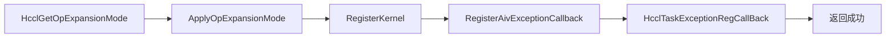
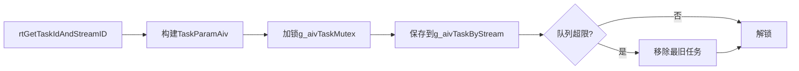
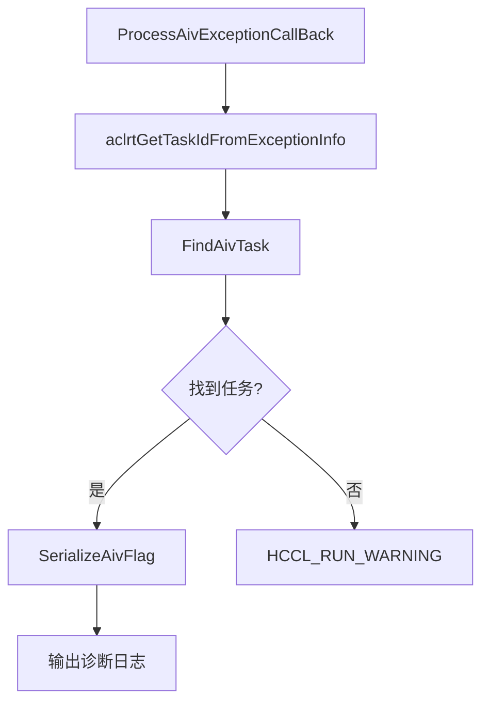
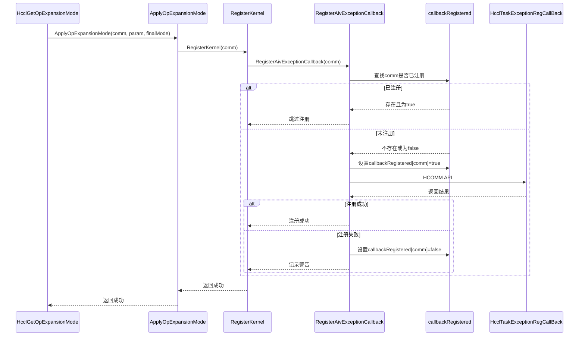
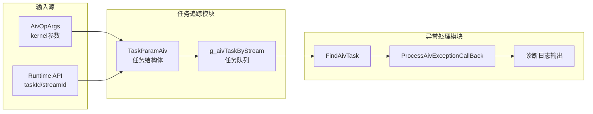
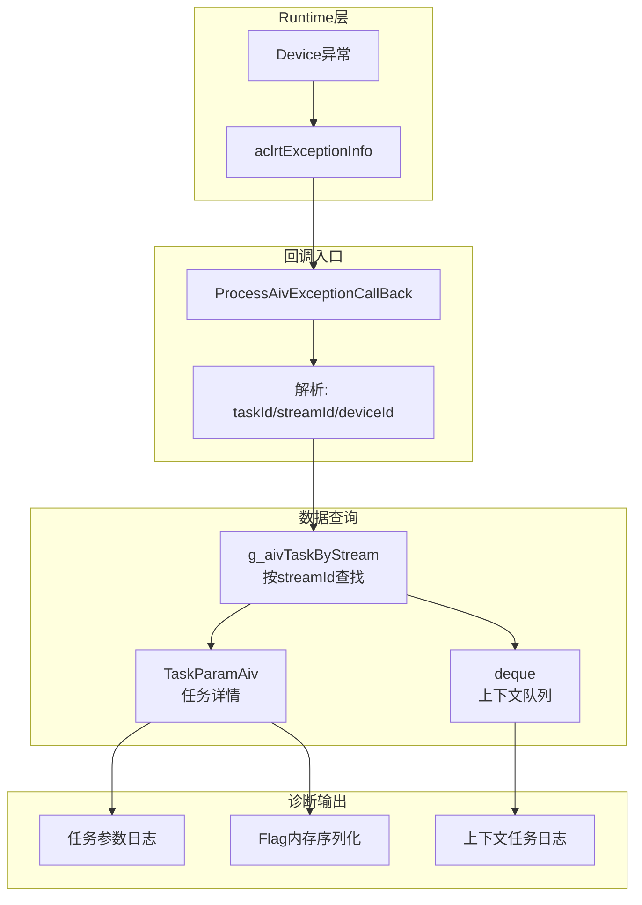

# AIV Task Exception Handler 设计文档

## 1. 概述

### 1.1 文档信息
| 项目 | 内容 |
|------|------|
| 模块名称 | AIV Task Exception Handler |
| 版本 | v1.0 |
| 作者 | 架构组 |
| 日期 | 2026-05-21 |
| 相关文件 | `hccl_aiv_utils.cc`, `hccl_aiv_utils.h`, `hcomm_host_profiling_dl.cc/h`, `op_common.cc` |

### 1.2 设计目标
当 AIV (AI Vector) kernel 执行失败时，自动捕获异常并输出详细的诊断信息，包括：
- 失败任务的完整参数信息
- 失败任务的 flag 内存状态
- 失败任务前的上下文任务信息
- 设备、流、任务标识等关键信息

### 1.3 适用场景
- AIV kernel 运行时异常
- 设备算力异常
- 内存访问异常
- 同步超时等硬件故障

---

## 2. 系统架构

### 2.1 模块划分

```
┌─────────────────────────────────────────────────────────────────────┐
│                    AIV Task Exception Handler                        │
├─────────────────────────────────────────────────────────────────────┤
│  ┌─────────────────┐  ┌─────────────────┐  ┌─────────────────────┐  │
│  │  回调注册模块    │  │  任务追踪模块    │  │  异常处理模块       │  │
│  │                 │  │                 │  │                     │  │
│  │ - 回调注册      │  │ - 任务信息采集   │  │ - 异常回调处理      │  │
│  │ - 防重复注册    │  │ - 任务队列管理   │  │ - 任务信息查询      │  │
│  │ - 能力检测      │  │ - 任务索引维护   │  │ - 诊断信息输出      │  │
│  └─────────────────┘  └─────────────────┘  └─────────────────────┘  │
│           │                    │                     │              │
│           └────────────────────┼─────────────────────┘              │
│                                ▼                                    │
│  ┌──────────────────────────────────────────────────────────────┐  │
│  │                     公共数据结构                              │  │
│  │  - TaskParamAiv (任务参数结构体)                              │  │
│  │  - g_aivTaskByStream (任务队列)                               │  │
│  │  - g_aivTaskCommMap (任务索引)                                │  │
│  └──────────────────────────────────────────────────────────────┘  │
└─────────────────────────────────────────────────────────────────────┘
```

### 2.2 模块职责

| 模块 | 职责 | 关键函数 |
|------|------|----------|
| **回调注册模块** | 在 RegisterKernel 中注册异常回调函数，每个通信域只注册一次 | `RegisterAivExceptionCallback()` |
| **任务追踪模块** | 在 kernel 启动时采集并保存任务上下文信息 | `SaveAivDfxTaskInfo()` |
| **异常处理模块** | 异常发生时被底层调用，输出诊断信息 | `ProcessAivExceptionCallBack()`, `FindAivTask()`, `SerializeAivFlag()` |

### 2.3 外部依赖

| 依赖模块 | 接口 | 用途 |
|----------|------|------|
| Runtime API | `rtGetTaskIdAndStreamID()` | 获取当前任务和流的标识 |
| Runtime API | `aclrtGetTaskIdFromExceptionInfo()` | 从异常信息获取 taskId |
| Runtime API | `aclrtGetStreamIdFromExceptionInfo()` | 从异常信息获取 streamId |
| Runtime API | `aclrtGetDeviceIdFromExceptionInfo()` | 从异常信息获取 deviceId |
| HCOMM API | `HcclTaskExceptionRegCallBack()` | 通过通信域注册异常回调函数 |

---

## 3. 核心数据结构

### 3.1 任务参数结构体

```cpp
struct TaskParamAiv {
    u64 taskId = 0;              // 任务ID，runtime分配
    u64 streamId = 0;            // 流ID
    HcclCMDType cmdType;         // 命令类型（AllReduce、Broadcast等）
    u32 tag = 0;                 // 切片标识
    u64 size = 0;                // 数据量（字节）
    u32 blockDim = 0;            // block数量
    u32 rankSize = 0;            // 参与rank总数
    s32 aivRdmaStep = 0;         // RDMA步骤
    void *flagMem = nullptr;     // flag内存地址（用于诊断）
    u32 rank = 0;                // 当前rank
    bool isOpbase = false;       // 是否为OpBase模式
    HcclReduceOp reduceOp;       // 归约操作类型
    HcclDataType dataType;       // 数据类型
    uint64_t beginTime = 0;      // 任务开始时间
};
```

### 3.2 全局数据结构

```cpp
// 任务队列：按 streamId 分组存储任务信息
static std::unordered_map<u64, std::deque<TaskParamAiv>> g_aivTaskByStream;

// 回调注册状态：防止重复注册（按 deviceId）
static std::unordered_map<s32, bool> callbackRegisteredByDevice;
```

### 3.3 配置常量

```cpp
constexpr u32 AIV_TASK_CONTEXT_SIZE = 50;    // 异常时打印前50个任务上下文
constexpr u32 AIV_TASK_QUEUE_LIMIT = 2048;   // 每个流最多保存2048个任务
constexpr u32 AIV_FLAG_PRINT_SIZE = 4096;    // 打印4KB的flag内存
constexpr u32 AIV_FLAG_UB_ALIGN_SIZE = 32;   // flag内存对齐大小
```

---

## 4. 核心流程

### 4.1 整体流程图




### 4.2 任务信息保存流程



### 4.3 异常回调处理流程



### 4.4 回调注册流程（时序图）



---

## 5. 数据流向

### 5.1 任务信息数据流



### 5.2 异常回调数据流



---

## 6. 关键设计决策

### 6.1 为什么在 RegisterKernel() 中注册回调？

| 原因 | 说明 |
|------|------|
| **每个算子只注册一次** | 不需要每次 kernel launch 都检查是否已注册 |
| **调用时机合适** | RegisterKernel() 在 ApplyOpExpansionMode() 中调用，此时有 HcclComm |
| **减少开销** | 避免每次 kernel launch 的注册检查开销 |

### 6.2 为什么使用 HcclComm 注册？

| 原因 | 说明 |
|------|------|
| **HCOMM 接口设计** | HCOMM 通过 HcclComm 获取 deviceLogicId，再获取 handler |
| **回调按设备存储** | 实际回调是按设备存储的，但需要通过 comm 获取设备信息 |
| **保持接口一致性** | 与现有 HCOMM API 设计保持一致 |

### 6.3 防重复注册机制

```cpp
static std::unordered_map<HcclComm, bool> callbackRegistered;
```

**原因**：
1. 每个通信域只需注册一次回调
2. RegisterKernel() 可能被多次调用，需要防重
3. 使用 `static` 保证全局唯一性

---

## 7. 性能与资源分析

### 7.1 内存开销

| 项目 | 单次大小 | 数量上限 | 总计 |
|------|----------|----------|------|
| TaskParamAiv | ~100 bytes | 2048/stream | ~200KB/stream |
| callbackRegisteredByDevice | 16 bytes/entry | N个device | ~N*16 bytes |

### 7.2 性能影响

| 操作 | 开销 | 频率 |
|------|------|------|
| rtGetTaskIdAndStreamID | ~1μs | 每次kernel启动 |
| 队列插入 | O(1) | 每次kernel启动 |
| 锁竞争 | mutex | 每次kernel启动 |
| 回调注册 | 一次性 | 每个device一次 |

### 7.3 关键路径优化

1. **注册时机提前**：在 RegisterKernel() 注册，避免每次 kernel launch 检查
2. **队列自动清理**：超限时移除最旧任务，避免内存泄漏
3. **按 stream 分组**：减少单个队列长度，提升查找效率

---

## 8. 错误处理

### 8.1 错误场景与处理

| 错误场景 | 处理方式 | 日志级别 |
|----------|----------|----------|
| `exceptionInfo` 为空 | 记录错误，直接返回 | ERROR |
| 获取 taskId/streamId 失败 | 返回 `HCCL_E_RUNTIME` | ERROR |
| 通信句柄为空 | 跳过回调注册 | DEBUG |
| 回调注册失败 | 设置 `callbackRegistered=false` | WARNING |
| 查找任务失败 | 记录警告，输出基本信息 | RUN_INFO |
| 拷贝 flag 内存失败 | 输出 "copy flagMem failed" | ERROR |

### 8.2 容错设计

```cpp
// 1. 保存任务信息失败不影响主流程
HcclResult dfxRet = SaveAivDfxTaskInfo(opArgs);
if (dfxRet != HCCL_SUCCESS) {
    HCCL_WARNING("[ExecuteKernelLaunchInner] SaveAivDfxTaskInfo failed, ret[%d].", dfxRet);
}
return HCCL_SUCCESS;  // 仍然返回成功

// 2. 回调注册失败仅记录警告
if (ret != HCCL_SUCCESS) {
    callbackRegistered[comm] = false;
    HCCL_WARNING("[AIV][RegisterAivExceptionCallback] register callback failed, ret[%d].", ret);
}
```

---

## 9. 扩展性设计

### 9.1 可扩展点

| 扩展点 | 当前实现 | 扩展方向 |
|--------|----------|----------|
| 任务参数 | `TaskParamAiv` | 可添加更多诊断字段 |
| 输出格式 | HCCL_ERROR 日志 | 可扩展为事件上报 |
| 队列策略 | 固定大小 FIFO | 可配置策略 |
| Flag 输出 | 4KB 序列化 | 可配置大小和格式 |

### 9.2 新增命令类型支持

只需在 `TaskParamAiv` 中添加字段，无需修改核心逻辑：

```cpp
// 示例：添加新字段
struct TaskParamAiv {
    // ... 现有字段
    u32 newField = 0;           // 新增字段
    std::string additionalInfo;  // 扩展信息
};
```

---

## 10. 测试建议

### 10.1 单元测试

| 测试项 | 测试内容 |
|--------|----------|
| MakeTaskKey | 验证 streamId 和 taskId 组合正确性 |
| SaveAivDfxTaskInfo | 验证任务信息保存和队列限制 |
| FindAivTask | 验证任务查找和边界条件 |
| SerializeAivFlag | 验证 flag 内存序列化格式 |
| RegisterAivExceptionCallback | 验证防重复注册逻辑 |

### 10.2 集成测试

| 测试场景 | 验证点 |
|----------|--------|
| Kernel 正常执行 | 任务信息正确保存 |
| Kernel 异常触发 | 回调正确执行，日志完整 |
| 多 stream 并发 | 队列隔离正确 |
| 队列满场景 | 正确清理旧任务 |
| 多 comm 场景 | 回调注册隔离 |

---

## 11. 总结

AIV Task Exception Handler 通过三层架构（回调注册、任务追踪、异常处理）实现了完整的异常诊断能力：

1. **被动式设计**：不主动检测，仅在异常发生时触发
2. **低侵入性**：对正常执行路径影响最小
3. **信息完整**：包含任务参数、flag 内存、上下文任务
4. **线程安全**：使用 mutex 保护全局数据结构
5. **资源可控**：队列限制防止内存泄漏

---

## 附录 A：关键函数签名

```cpp
// 回调函数类型
typedef void (*HcclTaskExceptionCallback)(aclrtExceptionInfo *exceptionInfo);

// 核心函数
HcclResult RegisterKernel(HcclComm comm);
HcclResult ApplyOpExpansionMode(HcclComm comm, OpParam &param, HcclOpExpansionMode finalMode);
HcclResult SaveAivDfxTaskInfo(const AivOpArgs &opArgs);
void ProcessAivExceptionCallBack(aclrtExceptionInfo *exceptionInfo);
static void RegisterAivExceptionCallback(HcclComm comm);
static bool FindAivTask(u32 streamId, u32 taskId, TaskParamAiv &taskInfo, std::deque<TaskParamAiv> &taskQueue);
static std::string SerializeAivFlag(const TaskParamAiv &taskInfo);

// HCOMM API
HcclResult HcclTaskExceptionRegCallBack(HcclComm comm, HcclTaskExceptionCallback callback);
```

## 附录 B：日志输出示例

```
[TaskExceptionHandler][AIV]Task run failed, para information is deviceId[0] streamId[123], 
TaskId[456], cmdType[5], tag[1],rank[0],rankSize[8], dataCount[1024], blockDim[128],
dataType:[1], beginTime[1716288000000000], flagMem[0x7fff12340000]

[TaskExceptionHandler][AIV]Task run failed, para information is deviceId[0] streamId[123], 
TaskId[456], flag: 1 2 3 4 5 6 7 8 9 10 ...

[TaskExceptionHandler][AIV]Task run failed, para information is deviceId[0] streamId[123], 
TaskId[456], task info before failed task is:
[TaskExceptionHandler][AIV] previous TaskId[455],streamId[123], cmdType[5], tag[1],rank[0],rankSize[8], 
dataCount[512], blockDim[128],dataType:[1], beginTime[1716287999000000], flagMem[0x7fff12340000]
...
```