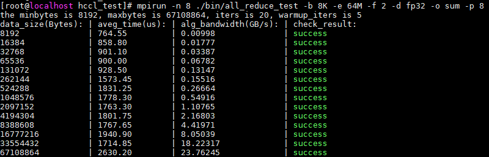

# 源码构建

## 环境准备

1. 安装依赖。

   HCCL集合通信库编译用到的依赖如下，请注意版本要求。

   - python: 3.7.x 至 3.11.4 版本
   - gcc >= 7.3.0
   - cmake >= 3.16.0
   - ccache
   - nlohmann_json
   - googletest（仅执行UT时依赖，建议版本 release-1.14.0）

   nlohmann_json和googletest可通过`build_third_party.sh`进行编译安装，可通过`--output_path`参数指定安装目录，默认为`./output/third_party`：

   ```shell
   bash build_third_party.sh --output_path=${THIRD_LIB_PATH}
   ```

2. 安装社区尝鲜版CANN Toolkit包

    编译本项目依赖CANN开发套件包（cann-toolkit），请根据操作系统架构，下载对应的CANN Toolkit安装包，参考[昇腾文档中心-CANN软件安装指南](https://www.hiascend.com/document/redirect/CannCommunityInstWizard)进行安装：

    - aarch64架构：[Ascend-cann-toolkit_9.0.0_linux-aarch64.run](https://mirror-centralrepo.devcloud.cn-north-4.huaweicloud.com/artifactory/cann-run-release/software/9.0.0/20260205000325321/aarch64/Ascend-cann-toolkit_9.0.0_linux-aarch64.run)
    - x86_64架构：[Ascend-cann-toolkit_9.0.0_linux-x86_64.run](https://mirror-centralrepo.devcloud.cn-north-4.huaweicloud.com/artifactory/cann-run-release/software/9.0.0/20260205000325321/x86_64/Ascend-cann-toolkit_9.0.0_linux-x86_64.run)

3. 设置CANN软件环境变量。

   ```shell
   # 默认路径，root用户安装
   source /usr/local/Ascend/cann/set_env.sh

   # 默认路径，非root用户安装
   source $HOME/Ascend/cann/set_env.sh
   ```

## 源码下载

```shell
# 下载项目源码，以master分支为例
git clone https://gitcode.com/cann/hccl.git
```

## 编译

本项目提供一键式编译构建能力，进入代码仓根目录，执行如下命令：

```shell
# 编译 host 包
bash build.sh --pkg
# 编译 host + device 包
bash build.sh --pkg --full
```

编译完成后会在`./build_out`目录下生成 `cann-hccl_<version>_linux-<arch>.run` 软件包。

> `<version>`表示软件版本号，`<arch>`表示操作系统架构，取值包括“x86_64”与“aarch64”。

## 安装

安装编译生成的HCCL软件包：

```shell
bash ./build_out/cann-hccl_<version>_linux-<arch>.run --full
```

请注意：编译时需要将上述命令中的软件包名称替换为实际编译生成的软件包名称。

安装完成后，用户编译生成的HCCL软件包会替换已安装CANN开发套件包中的HCCL相关软件。

## 卸载

卸载已安装的HCCL软件包：

```shell
bash ./build_out/cann-hccl_<version>_linux-<arch>.run --uninstall
```

请注意：卸载时需要将上述命令中的软件包名称替换为实际安装的软件包名称。

## LLT 测试

安装完编译生成的HCCL软件包后，可通过如下命令执行LLT用例。

```shell
bash build.sh --ut
```

## 上板测试

HCCL软件包安装完成后，开发者可通过HCCL Test工具进行集合通信功能与性能的测试，HCCL Test工具的使用流程如下：

1. 环境准备

   运行本项目除需安装CANN Toolkit开发套件包外，还需安装Ascend HDK包、Ascend-ops算子包，下载链接如下，安装方式可参考[昇腾文档中心-CANN软件安装指南](https://www.hiascend.com/document/redirect/CannCommunityInstWizard)进行安装：

   - Atlas A2系列产品:
     - Ascend HDK驱动包：[Ascend-hdk-910b-npu-driver_25.5.0.b061_linux-aarch64.run](https://ascend-cann.obs.cn-north-4.myhuaweicloud.com/CANN/community/hccl/Ascend-hdk-910b-npu-driver_25.5.0.b061_linux-aarch64.run)
     - Ascend HDK固件包：[Ascend-hdk-910b-npu-firmware_7.8.0.5.201.run](https://ascend-cann.obs.cn-north-4.myhuaweicloud.com/CANN/community/hccl/Ascend-hdk-910b-npu-firmware_7.8.0.5.201.run)
     - Ascend-ops包（aarch64架构）：[Ascend-cann-910b-ops_9.0.0_linux-aarch64.run](https://mirror-centralrepo.devcloud.cn-north-4.huaweicloud.com/artifactory/cann-run-release/software/9.0.0/20260205000325321/aarch64/Ascend-cann-910b-ops_9.0.0_linux-aarch64.run)
     - Ascend-ops包（x86_64架构）：[Ascend-cann-910b-ops_9.0.0_linux-x86_64.run](https://mirror-centralrepo.devcloud.cn-north-4.huaweicloud.com/artifactory/cann-run-release/software/9.0.0/20260205000325321/x86_64/Ascend-cann-910b-ops_9.0.0_linux-x86_64.run)

   - Atlas A3系列产品:
     - Ascend HDK驱动包：[Atlas-A3-hdk-npu-driver_25.5.0.b061_linux-aarch64.run](https://ascend-cann.obs.cn-north-4.myhuaweicloud.com/CANN/community/hccl/Atlas-A3-hdk-npu-driver_25.5.0.b061_linux-aarch64.run)
     - Ascend HDK固件包：[Atlas-A3-hdk-npu-firmware_7.8.0.5.201.run](https://ascend-cann.obs.cn-north-4.myhuaweicloud.com/CANN/community/hccl/Atlas-A3-hdk-npu-firmware_7.8.0.5.201.run)
     - Ascend-ops包（aarch64架构）：[Ascend-cann-A3-ops_9.0.0_linux-aarch64.run](https://mirror-centralrepo.devcloud.cn-north-4.huaweicloud.com/artifactory/cann-run-release/software/9.0.0/20260205000325321/aarch64/Ascend-cann-A3-ops_9.0.0_linux-aarch64.run)
     - Ascend-ops包（x86_64架构）：[Ascend-cann-A3-ops_9.0.0_linux-x86_64.run](https://mirror-centralrepo.devcloud.cn-north-4.huaweicloud.com/artifactory/cann-run-release/software/9.0.0/20260205000325321/x86_64/Ascend-cann-A3-ops_9.0.0_linux-x86_64.run)

2. 工具编译

   使用 HCCL Test 工具前需要安装 MPI 依赖，配置相关环境变量，并编译 HCCL Test 工具，详细操作方法可参见配套版本的[昇腾文档中心-HCCL 性能测试工具使用指南](https://hiascend.com/document/redirect/CannCommunityToolHcclTest)中的“工具编译”章节。

3. 关闭验签

   - hccl仓编译产生`cann-hccl_<version>_linux-<arch>.run`软件包中含有`aicpu_hccl.tar.gz`（Hccl AICPU 算子包)
   - `aicpu_hccl.tar.gz`会在业务启动时加载至Device，加载过程中默认会由驱动进行安全验签，确保包可信
   - 开发者下载hccl仓源码自行编译产生`aicpu_hccl.tar.gz`并不含签名头，为此需要关闭驱动安全验签的机制
   - 关闭验签方式：

      配套使用HDK 25.5.T2.B001或以上版本，并通过该HDK配套的npu-smi工具关闭验签。参考如下命令，以root用户在物理机上执行。
      以device 0为例：
      ```shell
      npu-smi set -t custom-op-secverify-enable -i 0 -d 1    # 使能验签配置
      npu-smi set -t custom-op-secverify-mode -i 0 -d 0      # 关闭客户自定义验签
      ```

4. 执行HCCL Test测试命令，测试集合通信的功能及性能

   以1个计算节点，8个NPU设备，测试AllReduce算子的性能为例，命令示例如下：

   ```shell
   # “/usr/local/Ascend”是root用户以默认路径安装的CANN软件安装路径，请根据实际情况替换
   cd /usr/local/Ascend/ascend-toolkit/latest/tools/hccl_test

   # 数据量（-b）从8KB到64MB，增量系数（-f）为2倍，参与训练的NPU个数为8
   mpirun -n 8 ./bin/all_reduce_test -b 8K -e 64M -f 2 -d fp32 -o sum -p 8
   ```

   工具的详细使用说明可参见[昇腾文档中心-HCCL 性能测试工具使用指南](https://hiascend.com/document/redirect/CannCommunityToolHcclTest)中的“工具执行”章节。

5. 查看结果

   执行完HCCL Test工具后，回显示例如下：

   

   - “check_result”为 success，代表通信算子执行结果成功，AllReduce 算子功能正确。
   - ”aveg_time“：集合通信算子的执行耗时，单位 us。
   - ”alg_bandwidth“：集合通信算子执行带宽，单位为 GB/s。
   - ”data_size“：单个 NPU 上参与集合通信的数据量，单位为 Bytes。


## 补充Docker安装

### 前提条件

* **Docker环境**：以Atlas A2产品（910B）为例，环境里宿主机已安装Docker引擎（版本1.11.2及以上）。

* **驱动与固件**：宿主机已安装昇腾NPU的[驱动与固件](https://www.hiascend.com/hardware/firmware-drivers/community?product=1&model=30&cann=8.0.RC3.alpha002&driver=1.0.26.alpha)Ascend HDK 24.1.0版本以上。安装指导详见《[CANN 软件安装指南](https://www.hiascend.com/document/detail/zh/CANNCommunityEdition/850alpha002/softwareinst/instg/instg_0005.html?Mode=PmIns&OS=openEuler&Software=cannToolKit)》。
  
    > **注意**：使用`npu-smi info`查看对应的驱动与固件版本。

### 下载镜像
拉取已预集成CANN软件包及`ops-nn`所需依赖的镜像。

1.  以root用户登录宿主机。
2.  执行拉取命令（请根据你的宿主机架构选择）：
    
    * ARM架构：
      
        ```bash
        docker pull --platform=arm64 swr.cn-south-1.myhuaweicloud.com/ascendhub/cann:8.5.0-910b-ubuntu22.04-py3.10-ops
        ```
    * X86架构：
    
        ```bash
        docker pull --platform=amd64 swr.cn-south-1.myhuaweicloud.com/ascendhub/cann:8.5.0-910b-ubuntu22.04-py3.10-ops
        ```
> **注意**：正常网速下，镜像下载时间约为5-10分钟。

### Docker运行

请根据以下命令运行docker：

```bash
docker run --name cann_container --device /dev/davinci0 --device /dev/davinci_manager --device /dev/devmm_svm --device /dev/hisi_hdc -v /usr/local/dcmi:/usr/local/dcmi -v /usr/local/bin/npu-smi:/usr/local/bin/npu-smi -v /usr/local/Ascend/driver/lib64/:/usr/local/Ascend/driver/lib64/ -v /usr/local/Ascend/driver/version.info:/usr/local/Ascend/driver/version.info -v /etc/ascend_install.info:/etc/ascend_install.info -it swr.cn-south-1.myhuaweicloud.com/ascendhub/cann:8.5.0-910b-ubuntu22.04-py3.10-ops bash
```
以下为用户需关注的参数说明：
| 参数 | 说明 | 注意事项 |
| :--- | :--- | :--- |
| `--name cann_container` | 为容器指定名称，便于管理。 | 可自定义。 |
| `--device /dev/davinci0` | 核心：将宿主机的NPU设备卡映射到容器内，可指定映射多张NPU设备卡。 | 必须根据实际情况调整：`davinci0`对应系统中的第0张NPU卡。请先在宿主机执行 `npu-smi info`命令，根据输出显示的设备号（如`NPU 0`, `NPU 1`）来修改此编号。|
| `-v /usr/local/Ascend/driver/lib64/:/usr/local/Ascend/driver/lib64/` | 关键挂载：将宿主机的NPU驱动库映射到容器内。 | - |

### 检查环境

进入容器后，验证环境和驱动是否正常。

-   **检查NPU设备**

    执行如下命令，若返回驱动相关信息说明已成功挂载。    
    ```bash    
    npu-smi info
    ```
-   **检查CANN安装**
    
    执行如下命令查看CANN Toolkit版本信息，默认最新商发版本（目前是8.5.0）。
    
    ```bash
    cat /usr/local/Ascend/ascend-toolkit/latest/opp/version.info
    ```

你已经拥有了一个“开箱即用”的算子开发环境。接下来，需要在这个环境里验证从源码到可运行算子的完整工具链。