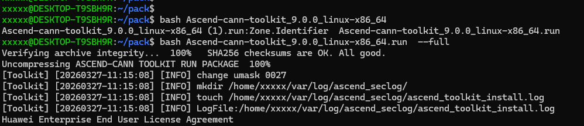
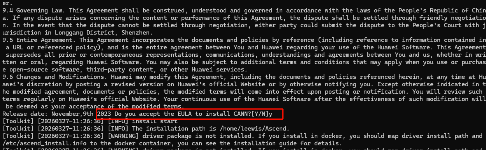
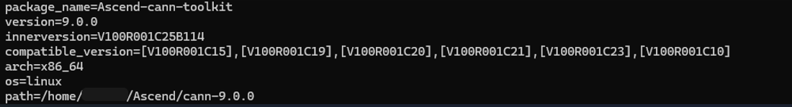

# HCCL 端到端编译部署完整教程

## 目录

- [一、环境准备](#一环境准备)
- [二、WSL + Ubuntu 20.04 安装](#二wsl--ubuntu-2004-安装)
- [三、Ubuntu 环境配置](#三ubuntu-环境配置)
- [四、CANN Toolkit 安装](#四cann-toolkit-安装)
- [五、HCCL 源码编译](#五hccl-源码编译)
- [六、HCCL 安装](#六hccl-安装)
- [七、单元测试（UT）](#七单元测试ut)
- [八、上板测试](#八上板测试)
- [九、常见问题](#九常见问题)

***

## 一、环境准备

### 1. 系统要求

- Windows 10 版本 2004 或更高版本（内部版本 19041 或更高）
- 或 Windows 11 任意版本
- 至少 8GB 内存（建议 16GB 以上）
- 至少 40GB 可用磁盘空间
- 支持 VT-x/AMD-V 虚拟化技术的 CPU

### 2. 检查Windows版本

- 按 `Win + R`，输入 `winver`，按回车
- 查看弹窗中的版本信息

### 3. 检查虚拟化支持

- 打开任务管理器（Ctrl + Shift + Esc）
- 切换到"性能"标签
- 点击"CPU"
- 查看右下角是否显示"虚拟化: 已启用"

***

## 二、WSL + Ubuntu 20.04 安装

### WSL 安装
#### 1. 启用WSL功能

```powershell
dism.exe /online /enable-feature /featurename:Microsoft-Windows-Subsystem-Linux /all /norestart
```

#### 2. 启用虚拟机平台

```powershell
dism.exe /online /enable-feature /featurename:VirtualMachinePlatform /all /norestart
```


#### 3. 重启电脑
- 执行完上述命令后，重启电脑，以确保所有更改生效。

#### 4. 设置WSL2为默认版本
```powershell
wsl --set-default-version 2
```

#### 5. 关闭正在运行的wsl虚拟机
```powershell
wsl --shutdown
```

#### 6. wsl 帮助文档
```powershell
wsl --help
```


### Ubuntu 20.04 安装
#### 1. 以管理员身份打开PowerShell

- 按 `Win + X`，选择"Windows PowerShell (管理员)"或"终端 (管理员)"

#### 2. 查看可用的在线os列表

```powershell
wsl --list --online
```


#### 3. 安装Ubuntu 20.04 并设置用户和密码

```powershell
wsl --install Ubuntu-20.04
```

- 用户名：建议使用小写字母，如 `yourname `
- 密码：输入时不会显示，输入后按回车确认

#### 4. 启动Ubuntu 20.04
```powershell
wsl -d Ubuntu-20.04
```
#### 5. 退出Ubuntu 20.04
```powershell
exit
```
#### 6. 设置Ubuntu 20.04 为默认版本

```powershell
wsl --set-default Ubuntu-20.04
```


#### 7. Ubuntu 访问路径
```powershell
\\wsl.localhost\Ubuntu-20.04\home
```

## 三、Ubuntu 环境配置

### 1. 更新系统

```bash
sudo apt update
sudo apt upgrade -y
```

### 2. 安装编译依赖

```bash
# 安装基础工具
sudo apt install -y git vim curl wget htop tree unzip

# 安装编译工具链
sudo apt install -y build-essential gdb

# 安装CMake
sudo apt install -y cmake

# 安装Python
sudo apt install -y python3 python3-pip

# 安装ccache（可选，提高二次编译速度）
sudo apt install -y ccache

### 3. 验证工具版本

```bash
# 检查GCC版本（需要 >= 7.3.0）
gcc --version

# 检查CMake版本（需要 >= 3.16.0）
cmake --version

# 检查Python版本
python3 --version
```

***

## 四、CANN Toolkit 安装

### 1. 下载CANN Toolkit包

- 访问 [CANN软件包归档页面](https://ascend.devcloud.huaweicloud.com/artifactory/cann-run-mirror/software/master/)
- 下载最新的CANN Toolkit安装包
- 文件名格式：`Ascend-cann-toolkit_<version>_linux-<arch>.run`
### 2. 安装CANN Toolkit

```bash
# 赋予执行权限
chmod +x Ascend-cann-toolkit_<version>_linux-<arch>.run

# 安装（--install-path为可选参数，用于指定安装路径）
bash Ascend-cann-toolkit_<version>_linux-<arch>.run --full --install-path=/usr/local/Ascend
```


**参数说明：**

- `<version>`: CANN包版本号
- `<arch>`: CPU架构，如aarch64、x86\_64
- `<install_path>`: 安装路径，可选，root用户默认安装在/usr/local/Ascend目录

### 3. 设置CANN环境变量

```bash
# 默认路径，root用户安装
source /usr/local/Ascend/cann/set_env.sh
```


### 4. 验证CANN安装

```bash
 # 查看CANN Toolkit开发套件包的version字段提供的版本信息（默认路径安装），<arch>表示CPU架构（aarch64或x86_64）。
 cat /usr/local/Ascend/cann/<arch>-linux/ascend_toolkit_install.info
 # 查看CANN ops算子包的version字段提供的版本信息（默认路径安装）。
 cat /usr/local/Ascend/cann/<arch>-linux/ascend_ops_install.info
```


## 五、HCCL 源码编译

### 1. 下载HCCL源码

```bash
# 克隆项目源码（以master分支为例）
git clone https://gitcode.com/cann/hccl.git

# 进入项目目录
cd hccl
```

### 2. 源码编译

#### 编包
##### 在线编包
```bash
# 编译 host 包
bash build.sh --pkg
# 编译 host + device 包
bash build.sh --pkg --full
```

##### 离线编包
编译时会自动下载开源第三方软件依赖中列出的依赖包。如果编译环境无法访问网络，您需要在联网环境中下载相关依赖压缩包，手动上传至编译环境，并通过 --cann_3rd_lib_path 参数指定依赖包的存放路径。
| 开源软件       | 版本     | 下载地址                                                                                                                                                                   |
| ---------- | ------ | ----------------------------------------------------------------------------------------------------------------------------------------------------------------------- |
| makeself   | 2.5.0  | [makeself-release-2.5.0-patch1.tar.gz](https://gitcode.com/cann-src-third-party/makeself/releases/download/release-2.5.0-patch1.0/makeself-release-2.5.0-patch1.tar.gz) |
| googletest | 1.14.0 | [googletest-1.14.0.tar.gz](https://gitcode.com/cann-src-third-party/googletest/releases/download/v1.14.0/googletest-1.14.0.tar.gz)                                      |

```bash
# 指定软件包路径，默认为：./third_party
bash build.sh --cann_3rd_lib_path={your_3rd_party_path}
```
- 编译完成后会在./build_out目录下生成 cann-hccl_<version>_linux-<arch>.run 软件包。
- 其中<version>表示软件版本号，<arch>表示操作系统架构，取值包括“x86_64”与“aarch64”。

### 3. 安装 HCCL 软件包
```bash
# 安装HCCL
bash ./build_out/cann-hccl_<version>_linux-<arch>.run --full
```
- 请注意：编译时需要将上述命令中的软件包名称替换为实际软件包名称。
- 安装完成后，用户编译生成的HCCL软件包会替换已安装CANN Toolkit开发套件包中的HCCL相关软件。


### 4. 卸载 HCCL 软件包
```bash
# 卸载HCCL
bash ./build_out/cann-hccl_<version>_linux-<arch>.run --uninstall
```
- 卸载编译生成的HCCL软件包，将会恢复到安装完CANN Toolkit开发套件包的状态。

## 六、执行测试用例

### 1. UT 测试

```bash
# 代码仓根目录执行测试命令
bash build.sh --ut
```

### 2. ST 测试

```bash
# 代码仓根目录执行测试命令
bash build.sh --st
```
## 七、学习资源

- WSL官方文档：<https://docs.microsoft.com/zh-cn/windows/wsl/>
- Ubuntu官方文档：<https://ubuntu.com/server/docs>
- CANN官方文档：<https://www.hiascend.com/document>
- HCCL API文档：<https://www.hiascend.com/document>
- Linux命令参考：<https://linux.die.net/>
