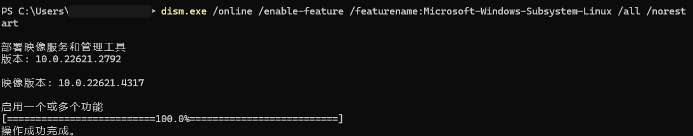
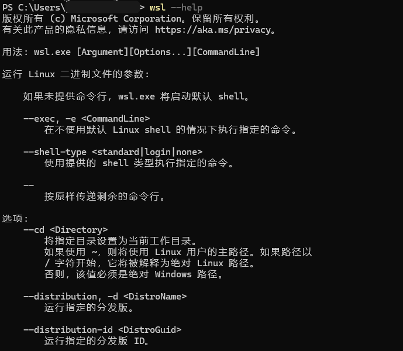
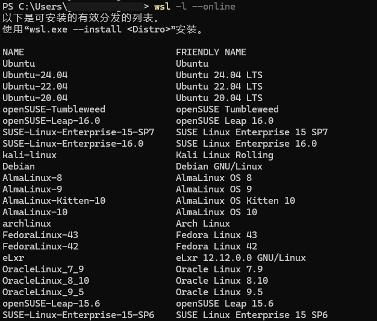
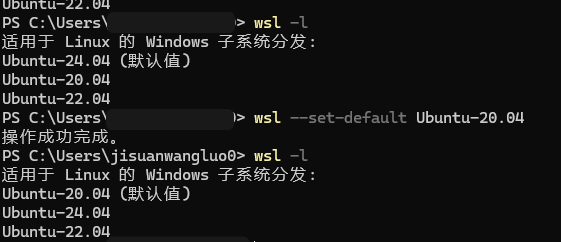

# HCCL 端到端编译部署完整教程

## 目录

- [一、环境准备](#一环境准备)
- [二、WSL + Ubuntu 20.04 安装](#二wsl--ubuntu-2004-安装)
- [三、Ubuntu 环境配置](#三ubuntu-环境配置)
- [四、CANN Toolkit 安装](#四cann-toolkit-安装)
- [五、HCCL 源码编译](#五hccl-源码编译)
- [六、HCCL 安装](#六hccl-安装)
- [七、单元测试（UT）](#七单元测试ut)
- [八、上板测试](#八上板测试)
- [九、常见问题](#九常见问题)

***

## 一、环境准备

### 1. 系统要求

- Windows 10 版本 2004 或更高版本（内部版本 19041 或更高）
- 或 Windows 11 任意版本
- 至少 8GB 内存（建议 16GB 以上）
- 至少 40GB 可用磁盘空间
- 支持 VT-x/AMD-V 虚拟化技术的 CPU

### 2. 检查Windows版本

- 按 `Win + R`，输入 `winver`，按回车
- 查看弹窗中的版本信息

### 3. 检查虚拟化支持

- 打开任务管理器（Ctrl + Shift + Esc）
- 切换到"性能"标签
- 点击"CPU"
- 查看右下角是否显示"虚拟化: 已启用"

***

## 二、WSL + Ubuntu 20.04 安装

### WSL 安装
#### 1. 启用WSL功能

```powershell
dism.exe /online /enable-feature /featurename:Microsoft-Windows-Subsystem-Linux /all /norestart
```

#### 2. 启用虚拟机平台

```powershell
dism.exe /online /enable-feature /featurename:VirtualMachinePlatform /all /norestart
```


#### 3. 重启电脑
- 执行完上述命令后，重启电脑，以确保所有更改生效。

#### 4. 设置WSL2为默认版本
```powershell
wsl --set-default-version 2
```

#### 5. 关闭正在运行的wsl虚拟机
```powershell
wsl --shutdown
```

#### 6. wsl 帮助文档
```powershell
wsl --help
```


### Ubuntu 20.04 安装
#### 1. 以管理员身份打开PowerShell

- 按 `Win + X`，选择"Windows PowerShell (管理员)"或"终端 (管理员)"

#### 2. 查看可用的在线os列表

```powershell
wsl --list --online
```


#### 3. 安装Ubuntu 20.04 并设置用户和密码

```powershell
wsl --install Ubuntu-20.04
```

- 用户名：建议使用小写字母，如 `yourname `
- 密码：输入时不会显示，输入后按回车确认

#### 4. 启动Ubuntu 20.04
```powershell
wsl -d Ubuntu-20.04
```
#### 5. 退出Ubuntu 20.04
```powershell
exit
```
#### 6. 设置Ubuntu 20.04 为默认版本

```powershell
wsl --set-default Ubuntu-20.04
```


## 三、Ubuntu 环境配置

### 1. 更新系统

```bash
sudo apt update
sudo apt upgrade -y
```

### 2. 安装编译依赖

```bash
# 安装基础工具
sudo apt install -y git vim curl wget htop tree

# 安装编译工具链
sudo apt install -y build-essential gdb

# 安装CMake
sudo apt install -y cmake

# 安装Python
sudo apt install -y python3 python3-pip

# 安装ccache（可选，提高二次编译速度）
sudo apt install -y ccache

# 安装unzip
sudo apt install -y unzip

### 3. 验证工具版本

```bash
# 检查GCC版本（需要 >= 7.3.0）
gcc --version

# 检查CMake版本（需要 >= 3.16.0）
cmake --version

# 检查Python版本
python3 --version
```

***

## 四、CANN Toolkit 安装

### 1. 下载CANN Toolkit包

- 访问 [CANN软件包归档页面](https://ascend.devcloud.huaweicloud.com/artifactory/cann-run-mirror/software/master/)
- 下载最新的CANN Toolkit安装包
- 文件名格式：`Ascend-cann-toolkit_<version>_linux-<arch>.run`
### 2. 安装CANN Toolkit

```bash
# 赋予执行权限
chmod +x Ascend-cann-toolkit_<version>_linux-<arch>.run

# 安装（--install-path为可选参数，用于指定安装路径）
bash Ascend-cann-toolkit_<version>_linux-<arch>.run --full --install-path=/usr/local/Ascend
```

**参数说明：**

- `<version>`: CANN包版本号
- `<arch>`: CPU架构，如aarch64、x86\_64
- `<install_path>`: 安装路径，可选，root用户默认安装在/usr/local/Ascend目录

### 3. 设置CANN环境变量

```bash
# 默认路径，root用户安装
source /usr/local/Ascend/cann/set_env.sh

# 将环境变量添加到 ~/.bashrc，使其永久生效
echo "source /usr/local/Ascend/cann/set_env.sh" >> ~/.bashrc
source ~/.bashrc
```

### 4. 验证CANN安装

```bash
# 检查环境变量
echo $ASCEND_HOME
echo $LD_LIBRARY_PATH

# 查看CANN版本
cat /usr/local/Ascend/cann/version.info
```

***

## 五、HCCL 源码编译

### 1. 下载HCCL源码

```bash
# 克隆项目源码（以master分支为例）
git clone https://gitcode.com/cann/hccl.git

# 进入项目目录
cd hccl
```

### 2. 准备第三方依赖

编译HCCL需要以下第三方开源软件：

| 开源软件       | 版本     | 下载地址                                                                                                                                                                    |
| ---------- | ------ | ----------------------------------------------------------------------------------------------------------------------------------------------------------------------- |
| makeself   | 2.5.0  | [makeself-release-2.5.0-patch1.tar.gz](https://gitcode.com/cann-src-third-party/makeself/releases/download/release-2.5.0-patch1.0/makeself-release-2.5.0-patch1.tar.gz) |
| googletest | 1.14.0 | [googletest-1.14.0.tar.gz](https://gitcode.com/cann-src-third-party/googletest/releases/download/v1.14.0/googletest-1.14.0.tar.gz)                                      |

#### 方法一：自动下载（推荐）

```bash
# 创建第三方依赖目录
mkdir -p third_party

# 下载依赖包
cd third_party

# 下载makeself
wget https://gitcode.com/cann-src-third-party/makeself/releases/download/release-2.5.0-patch1.0/makeself-release-2.5.0-patch1.tar.gz

# 下载googletest
wget https://gitcode.com/cann-src-third-party/googletest/releases/download/v1.14.0/googletest-1.14.0.tar.gz

cd ..
```

#### 方法二：手动上传

如果编译环境无法访问网络：

1. 在联网环境中下载上述软件包
2. 手动上传至编译环境的 `./third_party` 目录

### 3. 编译HCCL

```bash
# 编译 host 包
bash build.sh --pkg

# 编译 host + device 包
bash build.sh --pkg --full

# 指定第三方软件包路径（如果不在默认路径）
bash build.sh --pkg --full --cann_3rd_lib_path=./third_party
```

**编译参数说明：**

- `--pkg`: 编译生成安装包
- `--full`: 编译host + device包
- `--cann_3rd_lib_path`: 指定第三方依赖路径，默认为 `./third_party`

### 4. 查看编译结果

```bash
# 编译完成后，安装包会生成在 build_out 目录
ls -lh build_out/

# 应该看到类似以下的文件：
# cann-hccl_<version>_linux-x86_64.run
```

***

## 六、HCCL 安装

### 1. 安装HCCL软件包

```bash
# 进入build_out目录
cd build_out

# 赋予执行权限
chmod +x cann-hccl_<version>_linux-<arch>.run

# 安装（将软件包名称替换为实际编译生成的软件包名称）
bash cann-hccl_<version>_linux-<arch>.run --full
```

### 2. 验证安装

```bash
# 检查HCCL库文件
ls -lh /usr/local/Ascend/ascend-toolkit/latest/lib64/libhccl*

# 检查HCCL头文件
ls -lh /usr/local/Ascend/ascend-toolkit/latest/include/hccl.h
```

### 3. 卸载HCCL（如果需要）

```bash
bash cann-hccl_<version>_linux-<arch>.run --uninstall
```

***

## 七、单元测试（UT）

### 1. 执行LLT测试

```bash
# 返回HCCL源码根目录
cd /path/to/hccl

# 执行UT测试
bash build.sh --ut
```

### 2. 查看测试结果

```bash
# 测试结果会显示在终端输出中
# 查看测试报告（如果有生成）
cat build_out/test_results/*.xml
```

### 3. 常见测试问题

- 如果测试失败，检查CANN环境变量是否正确设置
- 确保所有依赖都已正确安装
- 查看错误日志获取详细信息

***

## 八、上板测试

### 1. 环境准备

#### 1.1 安装NPU驱动和固件

参考[昇腾文档中心-CANN软件安装指南](https://www.hiascend.com/document/redirect/CannCommunityInstWizard)中的"安装NPU驱动和固件"章节：

```bash
# 安装驱动
./Ascend-hdk-<chip_type>-npu-driver_<version>_linux-<arch>.run --full --install-for-all

# 安装固件
./Ascend-hdk-<chip_type>-npu-firmware_<version>.run --full
```

#### 1.2 安装CANN ops算子包

从[CANN软件包归档页面](https://ascend.devcloud.huaweicloud.com/artifactory/cann-run-mirror/software/master/)下载对应的CANN ops包：

```bash
# 安装算子包
bash Ascend-cann-<chip_type>-ops_<version>_linux-<arch>.run --install
```

**参数说明：**

- `<chip_type>`: NPU产品型号
- `<version>`: CANN包版本号
- `<arch>`: CPU架构，如aarch64、x86\_64

### 2. 工具编译

#### 2.1 配置MPI环境

```bash
# 设置MPI环境变量
export PATH=/usr/lib/openmpi/bin:$PATH
export LD_LIBRARY_PATH=/usr/lib/openmpi/lib:$LD_LIBRARY_PATH

# 验证MPI安装
mpirun --version
```

#### 2.2 编译HCCL Test工具

详细操作方法可参见配套版本的[昇腾文档中心-HCCL 性能测试工具使用指南](https://hiascend.com/document/redirect/CannCommunityToolHcclTest)中的"工具编译"章节。

### 3. 关闭验签

HCCL仓编译产生的 `aicpu_hccl.tar.gz` 不含签名头，需要关闭驱动安全验签机制：

```bash
# 配套使用HDK 25.5.T2.B001或以上版本
# 以root用户在物理机上执行，以device 0为例：
npu-smi set -t custom-op-secverify-enable -i 0 -d 1    # 使能验签配置
npu-smi set -t custom-op-secverify-mode -i 0 -d 0      # 关闭客户自定义验签
```

### 4. 执行HCCL Test测试

以1个计算节点，8个NPU设备，测试AllReduce算子的性能为例：

```bash
# 进入HCCL Test工具目录
cd /usr/local/Ascend/ascend-toolkit/latest/tools/hccl_test

# 数据量（-b）从8KB到64MB，增量系数（-f）为2倍，参与训练的NPU个数为8
mpirun -n 8 ./bin/all_reduce_test -b 8K -e 64M -f 2 -d fp32 -o sum -p 8
```

**参数说明：**

- `-b`: 起始数据量
- `-e`: 结束数据量
- `-f`: 增量系数
- `-d`: 数据类型（fp32, fp16等）
- `-o`: 操作类型（sum, max, min等）
- `-p`: 参与训练的NPU个数

### 5. 查看测试结果

执行完HCCL Test工具后，回显示例如下：

```
check_result: success
aveg_time: 1234.56 us
alg_bandwidth: 12.34 GB/s
data_size: 8192 Bytes
```

**结果说明：**

- `check_result`: success 表示通信算子执行结果成功
- `aveg_time`: 集合通信算子的执行耗时，单位 us
- `alg_bandwidth`: 集合通信算子执行带宽，单位为 GB/s
- `data_size`: 单个 NPU 上参与集合通信的数据量，单位为 Bytes

***

## 九、常见问题

### 1. WSL相关问题

#### WSL安装失败

- 确保Windows版本符合要求
- 检查BIOS中是否启用了虚拟化技术（VT-x/AMD-V）
- 尝试使用Windows Update更新系统

#### 网络连接问题

```bash
# 重启WSL网络
wsl --shutdown
# 重新打开Ubuntu
```

#### 磁盘空间不足

```powershell
# 压缩WSL虚拟磁盘
wsl --shutdown
# 在PowerShell中执行
Optimize-VHD -Path "C:\Users\你的用户名\AppData\Local\Packages\CanonicalGroupLimited...\LocalState\ext4.vhdx" -Mode Full
```

### 2. 编译相关问题

#### GCC版本不满足要求

```bash
# 检查GCC版本
gcc --version

# 如果版本过低，安装新版本
sudo apt install -y gcc-9 g++-9
sudo update-alternatives --install /usr/bin/gcc gcc /usr/bin/gcc-9 90
sudo update-alternatives --install /usr/bin/g++ g++ /usr/bin/g++-9 90
```

#### CMake版本不满足要求

```bash
# 检查CMake版本
cmake --version

# 如果版本过低，安装新版本
wget https://github.com/Kitware/CMake/releases/download/v3.26.0/cmake-3.26.0-linux-x86_64.sh
chmod +x cmake-3.26.0-linux-x86_64.sh
sudo ./cmake-3.26.0-linux-x86_64.sh --skip-license --prefix=/usr/local
```

#### Python版本不满足要求

```bash
# 检查Python版本
python3 --version

# 安装指定版本的Python
sudo apt install -y python3.9 python3.9-dev
sudo update-alternatives --install /usr/bin/python3 python3 /usr/bin/python3.9 1
```

### 3. CANN相关问题

#### CANN环境变量未设置

```bash
# 手动设置环境变量
source /usr/local/Ascend/cann/set_env.sh

# 检查环境变量
echo $ASCEND_HOME
echo $LD_LIBRARY_PATH
```

#### CANN Toolkit安装失败

- 检查系统架构是否匹配
- 确保有足够的磁盘空间
- 查看安装日志获取详细错误信息

### 4. HCCL编译相关问题

#### 第三方依赖下载失败

```bash
# 手动下载依赖包
cd third_party
wget https://gitcode.com/cann-src-third-party/makeself/releases/download/release-2.5.0-patch1.0/makeself-release-2.5.0-patch1.tar.gz
wget https://gitcode.com/cann-src-third-party/googletest/releases/download/v1.14.0/googletest-1.14.0.tar.gz
```

#### 编译错误：找不到某个头文件

```bash
# 检查CANN环境变量是否正确设置
source /usr/local/Ascend/cann/set_env.sh

# 检查头文件是否存在
find /usr/local/Ascend -name "hccl.h"
```

### 5. 测试相关问题

#### UT测试失败

```bash
# 检查测试日志
cat build_out/test_results/*.log

# 重新编译并测试
bash build.sh --pkg --clean
bash build.sh --ut
```

#### HCCL Test工具找不到

```bash
# 检查HCCL Test工具是否安装
ls -lh /usr/local/Ascend/ascend-toolkit/latest/tools/hccl_test

# 如果不存在，需要安装完整的CANN Toolkit包
```

#### 上板测试失败

- 确保NPU驱动和固件已正确安装
- 检查NPU设备状态：`npu-smi info`
- 确保已关闭验签
- 检查MPI环境是否正确配置

***

## 十、备份与恢复

### 1. 备份WSL环境

```powershell
# 导出WSL环境
wsl --export Ubuntu-20.04 D:\backup\ubuntu_$(Get-Date -Format 'yyyyMMdd').tar
```

### 2. 备份HCCL编译产物

```bash
# 备份编译生成的安装包
cp build_out/cann-hccl_*.run ~/backup/
```

### 3. 恢复WSL环境

```powershell
# 导入WSL环境
wsl --import Ubuntu-20.04 D:\WSL\Ubuntu D:\backup\ubuntu_20240325.tar
```

***

## 十一、学习资源

- WSL官方文档：<https://docs.microsoft.com/zh-cn/windows/wsl/>
- Ubuntu官方文档：<https://ubuntu.com/server/docs>
- CANN官方文档：<https://www.hiascend.com/document>
- HCCL API文档：<https://www.hiascend.com/document>
- Linux命令参考：<https://linux.die.net/>

***

## 十二、快速参考

### 常用命令速查

```bash
# WSL命令
wsl --list --verbose              # 查看WSL状态
wsl --shutdown                    # 关闭WSL
wsl -d Ubuntu-20.04               # 进入Ubuntu

# Ubuntu系统管理
sudo apt update                   # 更新软件包列表
sudo apt upgrade -y               # 升级软件包
sudo apt install <package>        # 安装软件包

# 编译相关
bash build.sh --pkg               # 编译host包
bash build.sh --pkg --full        # 编译host+device包
bash build.sh --ut                # 执行UT测试

# CANN环境
source /usr/local/Ascend/cann/set_env.sh  # 设置CANN环境变量

# 测试相关
mpirun -n 8 ./bin/all_reduce_test -b 8K -e 64M -f 2  # HCCL Test
```

***

## 附录

### A. 完整的环境变量配置

```bash
# 添加到 ~/.bashrc
export PATH=/usr/local/Ascend/ascend-toolkit/latest/bin:$PATH
export LD_LIBRARY_PATH=/usr/local/Ascend/ascend-toolkit/latest/lib64:$LD_LIBRARY_PATH
export PYTHONPATH=/usr/local/Ascend/ascend-toolkit/latest/python/site-packages:$PYTHONPATH
export ASCEND_HOME=/usr/local/Ascend/ascend-toolkit/latest
export ASCEND_OPP_PATH=/usr/local/Ascend/ascend-toolkit/latest/opp
export PATH=/usr/lib/openmpi/bin:$PATH
export LD_LIBRARY_PATH=/usr/lib/openmpi/lib:$LD_LIBRARY_PATH

# 使配置生效
source ~/.bashrc
```

### B. 目录结构说明

```
hccl/
├── build.sh              # 编译脚本
├── build_out/            # 编译输出目录
│   └── cann-hccl_*.run   # 生成的安装包
├── third_party/          # 第三方依赖目录
├── src/                  # 源代码目录
├── include/              # 头文件目录
├── cmake/                # CMake配置文件
└── docs/                 # 文档目录
```

***

**提示**：安装和编译过程中如遇到问题，可以查看相关日志文件，或使用 `wsl --status` 查看WSL状态。建议定期备份WSL环境和编译产物。
