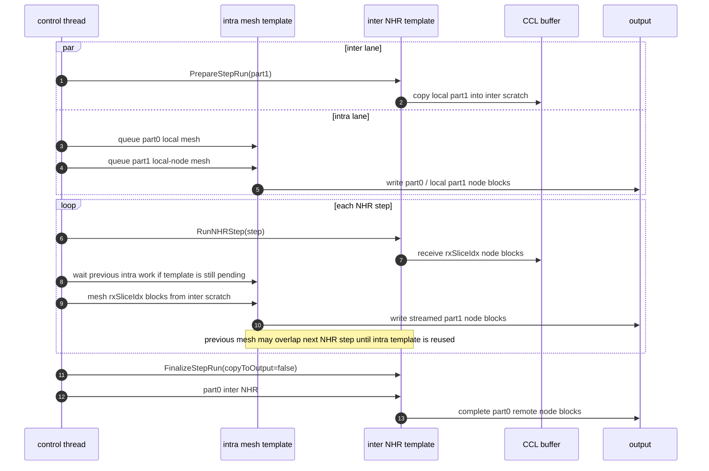
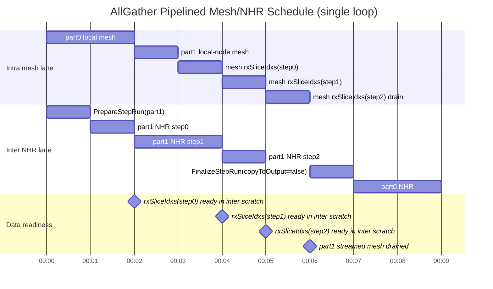
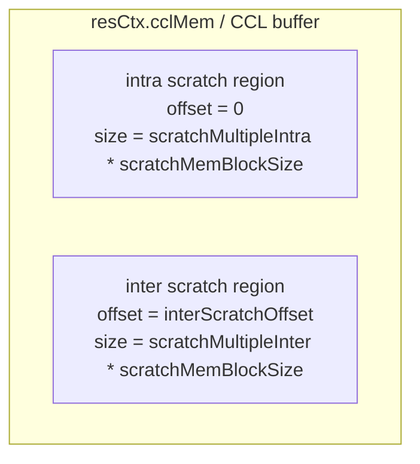
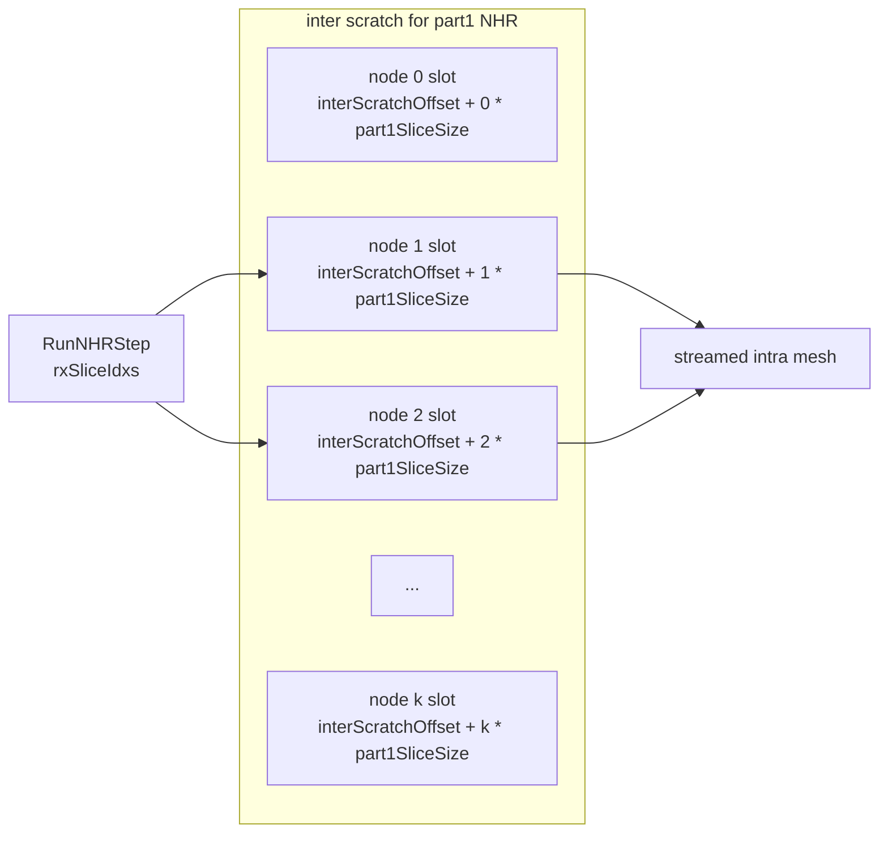
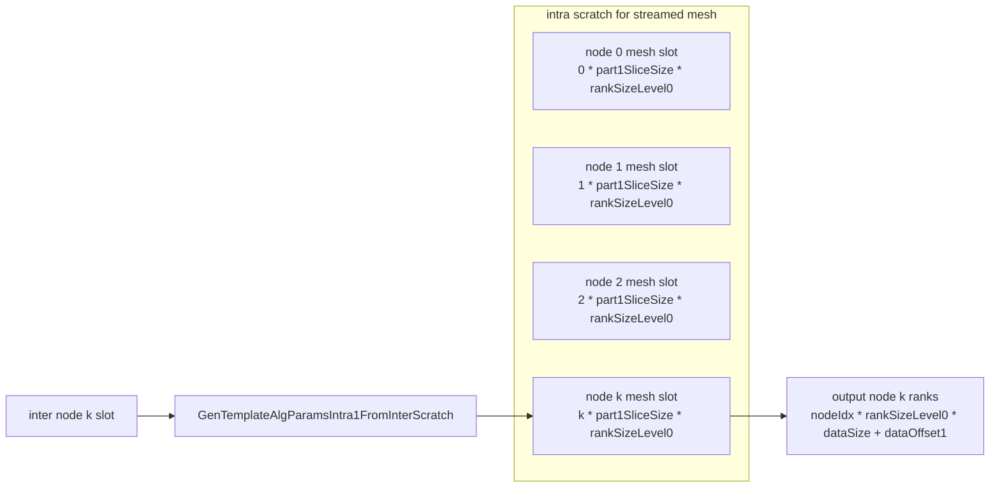

# AllGather NHR Step Mesh Pipeline

## 背景

现有 `InsAllGatherParallelMesh1DNHR` 将 AllGather 数据拆成两段：

- `part0 = 1 - multipleDimensionSplitRatio`：先执行 Server 内 `mesh`，再执行 Server 间 `nhr`。
- `part1 = multipleDimensionSplitRatio`：先执行 Server 间 `nhr`，再执行 Server 内 `mesh`。

原方案以阶段为同步边界，`part1` 必须等待完整 NHR 完成后才进入 Server 内 mesh。新方案在 `part1` 的 NHR 每完成一个 step 后，立即将本 step 新收到的 node 数据送入 Server 内 mesh，以减少 Server 内链路等待时间。

数据比例仍由 `param.opConfig.multipleDimensionSplitRatio` 配置。代码和文档不固化特定比例，实际最优比例由测试决定。

## 整体流程

新增 AICPU/Ins executor：

```cpp
InsAllGatherPipelinedMesh1DNHR
```

该 executor 只注册 AICPU/Ins 模板，不接入 CCU fast launch。CCU 路径继续使用现有 executor。

单 loop 内的逻辑顺序如下：

```cpp
PreSyncIntraAndInter();

// Inter lane: part1 NHR does not wait for part0 mesh.
PrepareInterNHRPart1(dataOffset1, currCountPart1);

// Intra lane: these two mesh tasks are queued on the intra template.
RunIntraMeshPart0(dataOffset0, currCountPart0);
RunIntraMeshPart1LocalNode(dataOffset1, currCountPart1);

for (u32 step = 0; step < nSteps; ++step) {
    AicpuNHRStepInfo stepInfo;
    RunInterNHRStepPart1(step, stepInfo);

    for (u32 nodeIdx : stepInfo.rxSliceIdxs) {
        WaitPreviousIntraIfNeeded();
        RunIntraMeshPart1FromInterScratch(nodeIdx, dataOffset1, currCountPart1);
    }
}
WaitPreviousIntraIfNeeded();
FinalizeInterNHRPart1(copyToOutput = false);

RunInterNHRPart0(dataOffset0, currCountPart0);
```

### 执行流水示意

下面的图强调两条链路的依赖关系。`part1` 的 NHR step 每收到一批 node 数据后，会触发对应 node 的 Server 内 mesh；实现中允许保留一个 pending 的 Server 内 mesh，在下一次需要复用 intra template 前再等待，使上一批 streamed mesh 与下一次 NHR step 有机会重叠。



从 lane 的角度看，真实流水线不是所有任务从同一个起点并排展开，而是：

- `part1 NHR` 不等待 `part0 mesh`，两条 lane 在第一阶段同时启动。
- `part0 mesh` 和 `part1 local mesh` 共享 intra template，二者在 intra lane 上顺序执行。
- `part1 NHR step0` 完成后，`step0 rx` 对应的 streamed mesh 等 intra lane 可复用后启动。
- `part1 NHR step1` 可以和 `step0 rx mesh` 重叠。
- `part1 NHR step2` 可以和 `step1 rx mesh` 重叠。
- 每次需要复用 intra template 前，等待上一批 pending mesh 完成。
- 所有 `part1` streamed mesh 完成后，才进入 `part0 NHR`。



图中以 3 个 NHR step 为例，横轴的 `00:00` 到 `00:09` 仅对应逻辑时间 `T0` 到 `T9`，用于表达依赖和重叠窗口，不代表固定耗时比例。真实流水线是：

- `part1 PrepareStepRun` 和 `part1 NHR step` 不依赖 `part0 mesh`，可以与 `part0 mesh`、`part1 local mesh` 同时在 inter lane 上推进。
- `part0 mesh` 和 `part1 local mesh` 仍在 intra lane 上顺序执行，因为它们共享同一个 intra template。
- `NHR step0` 结束时，`rxSliceIdxs(step0)` 已经落在 inter scratch；对应的 `mesh rx0` 起点是 `max(NHR step0 end, part0 mesh + part1 local mesh end)`。
- `mesh rx0` 与 `NHR step1` 重叠，`mesh rx1` 与 `NHR step2` 重叠。
- 每次要复用 intra template 启动下一批 streamed mesh 前，先等待上一批 pending mesh 完成；如果 mesh 比下一次 NHR step 更慢，流水线会在该边界处回压。
- `mesh rx2` 是最后一批，没有后续 NHR step 可重叠，因此 drain 完成后才执行 `FinalizeStepRun(copyToOutput=false)` 和 `part0 NHR`。

## NHR Step 接口

`InsTempAllGatherNHR` 增加 step 级接口：

```cpp
HcclResult PrepareStepRun(const OpParam &param,
                          const TemplateDataParams &tempAlgParams,
                          TemplateResource &templateResource);

HcclResult RunNHRStep(const std::vector<ThreadHandle> &threads,
                      const std::map<u32, std::vector<ChannelInfo>> &channels,
                      const u32 channelIdx,
                      const u32 step,
                      AicpuNHRStepInfo &stepInfo);

HcclResult FinalizeStepRun(const std::vector<ThreadHandle> &threads,
                           const u32 channelIdx,
                           bool copyToOutput);
```

旧 `KernelRun` 保持可用，旧 executor 不依赖新调度。兼容路径仍等价于：

```cpp
PrepareStepRun(...);
for (u32 channelIdx = 0; channelIdx < channelsPerRank_; ++channelIdx) {
    for (u32 step = 0; step < GetNHRStepNum(templateRankSize_); ++step) {
        RunNHRStep(..., channelIdx, step, stepInfo);
    }
    FinalizeStepRun(..., channelIdx, true);
}
```

### 为什么拆出三个 NHR 接口

旧 `InsTempAllGatherNHR::KernelRun` 的粒度是完整 NHR，它一次性完成：

- 初始化模板状态、计算多 channel 数据切分、同步 NHR 子线程。
- 将本 rank 的本地数据拷到 NHR scratch。
- 在内部循环跑完整个 `RunAllGatherNHR`，即所有 NHR step。
- 将 scratch 中的全量 NHR 结果 `PostLocalCopy` 到 output。
- 做 NHR 子线程收尾同步。

流水线方案需要打破的是“完整 NHR 完成后才进入 mesh”的阶段边界。`part1` 每完成一个 NHR step 后，executor 必须立刻拿到本 step 新收到的 `rxSliceIdxs`，并把这些 node 的数据送入 server 内 mesh。如果仍只暴露完整 `KernelRun`，`rxSliceIdxs` 被藏在 NHR 内部循环里，外层 executor 无法在 step 之间插入 streamed mesh。

因此 NHR 被拆成生命周期接口，而不是新增三套算法：

- `PrepareStepRun`：执行一次性准备工作，保存 `tempAlgParams_`、设置 `dataType_`/`isDmaRead_`、计算多 channel split、同步 NHR 子线程，并把本地数据 copy 到 inter scratch。
- `RunNHRStep`：只执行指定 `step` 的 NHR send/recv，复用原有 `GetStepInfo` 计算 `txSliceIdxs`/`rxSliceIdxs`，并通过 `stepInfo` 把本 step 收到的 node 切片暴露给 executor。
- `FinalizeStepRun`：执行收尾。兼容旧语义时传 `copyToOutput=true`，会执行原来的 `PostLocalCopy`；流水线 `part1` 传 `copyToOutput=false`，因为 `part1` 的最终 output 由后续 streamed mesh 写入。

关键实现对应如下：

```cpp
// PrepareStepRun: 原 KernelRun 的前半段。
tempAlgParams_ = tempAlgParams;
dataType_ = param.DataDes.dataType;
isDmaRead_ = IsPcieProtocol(templateResource.channels);
PreprareDataSplitForMultiChannel(templateResource);
PreSyncInterThreads(...);        // 多 NHR channel 时同步子线程
for (u32 channelIdx = 0; channelIdx < channelsPerRank_; ++channelIdx) {
    LocalDataCopy(templateResource.threads, channelIdx);
}

// RunNHRStep: 原 RunAllGatherNHR 内部 step 循环的一次迭代。
GetStepInfo(step, nSteps, stepInfo);
channelRecv = channels.at(GetRankFromMap(stepInfo.fromRank))[channelIdx];
channelSend = channels.at(GetRankFromMap(stepInfo.toRank))[channelIdx];
Build tx/rx DataSlice by stepInfo.txSliceIdxs/rxSliceIdxs;
SendRecvRead(...) or SendRecvBatchWrite(...);

// FinalizeStepRun: 原 KernelRun 的后半段。
if (copyToOutput) {
    PostLocalCopy(threads, channelIdx);
}
if (last channel) {
    PostSyncInterThreads(...);
}
```

### 为什么不新增 Mesh Step 接口

Mesh 模板不需要类似拆分，因为流水线里需要被切开的生产者是 NHR。executor 需要知道 NHR 每个 step 新收到哪些 node 数据，才能决定触发哪些 streamed mesh；这个信息只存在于 NHR 的 `GetStepInfo`/`rxSliceIdxs`。

Mesh 侧已经可以通过现有 `KernelRun` 表达足够小的调度粒度：executor 每次生成一组新的 `TemplateDataParams`，让同一个 mesh template 只处理一个 `nodeIdx` 的 `part1` 数据。也就是说，Mesh 的分批不需要改模板内部循环，只需要改输入、输出和 scratch 偏移：

```cpp
GenTemplateAlgParamsIntra1FromInterScratch(..., nodeIdx, ...);
tempAlgParamsIntra1.buffInfo.inputPtr = resCtx.cclMem.addr;
tempAlgParamsIntra1.buffInfo.inBuffType = BufferType::HCCL_BUFFER;
tempAlgParamsIntra1.buffInfo.inBuffBaseOff =
    interScratchOffset + nodeIdx * sliceSize;
tempAlgParamsIntra1.buffInfo.outBuffBaseOff =
    nodeIdx * rankSizeLevel0_ * dataSize_ + dataOffset;
tempAlgParamsIntra1.buffInfo.hcclBuffBaseOff =
    intraScratchOffset + nodeIdx * sliceSize * rankSizeLevel0_;
tempAlgParamsIntra1.repeatNum = 1;

tempAlgIntra.KernelRun(param, tempAlgParamsIntra1, intraTempAlgRes);
```

因此本方案只扩展 NHR template 的 step 级接口；Mesh template 保持原接口，由 executor 通过参数化多次调用完成 streamed mesh。

## CCL Buffer 排布

CCL/HCCL 临时 buffer 的总体分区沿用 parallel executor：

```cpp
intraScratchOffset = 0;
interScratchOffset = scratchMultipleIntra * scratchMemBlockSize;
```

总体布局：



`part1` 的 inter scratch 由 NHR 使用，按 node 切 slot。NHR 每个 step 收到的数据保留在对应 `rxSliceIdx` slot：



`part1` 的 intra scratch 由 Mesh 使用，每个 streamed node 使用独立 mesh scratch slot。slot stride 使用 Mesh 模板现有规则：

```cpp
nodeIntraScratchBase =
    intraScratchOffset + nodeIdx * currCountPart1 * dataTypeSize * rankSizeLevel0;
```

对应布局：



不使用 `scratchMemBlockSize` 作为 streamed mesh 的 node stride，避免与 `InsTempAllGatherMesh1D` 的 `scratchRepeatStride = sliceSize * templateRankSize` 不一致。

`part1` 的 NHR 不再执行全量 post-copy 到 output；收到的数据由后续 streamed mesh 从 inter scratch 读取，并写入最终 output。

## 回退方式

现有 `InsAllGatherParallelMesh1DNHR` 保留注册和实现。若需要回退，可在 selector 中将 `InsAllGatherPipelinedMesh1DNHR` 改回原注册名，或通过显式算法选择使用旧 executor。

## 验证清单

- 新 executor 只接入 AICPU/Ins，不影响 CCU。
- CCL/HCCL temp buffer 总分区沿用 parallel executor，无全局重排。
- `part1` inter scratch 中的 `rxSliceIdx` 数据能被 streamed mesh 正确读取。
- streamed mesh 的 intra scratch slot 按 `sliceSize * rankSizeLevel0` 排布。
- `part1` 不依赖 NHR 全量 post-copy。
- `part1` 本节点数据也执行节点内 mesh。
- `part0` 仍按 `mesh -> nhr` 执行。
- `multipleDimensionSplitRatio` 语义保持不变：表示 `part1` 比例。
- selector 只替换目标 AICPU 分支。
- 不硬编码任何测试推导比例。
