# HCCL 模拟运行器数据模型设计

## 软硬件资源交互关系建模
数据流交互示意图
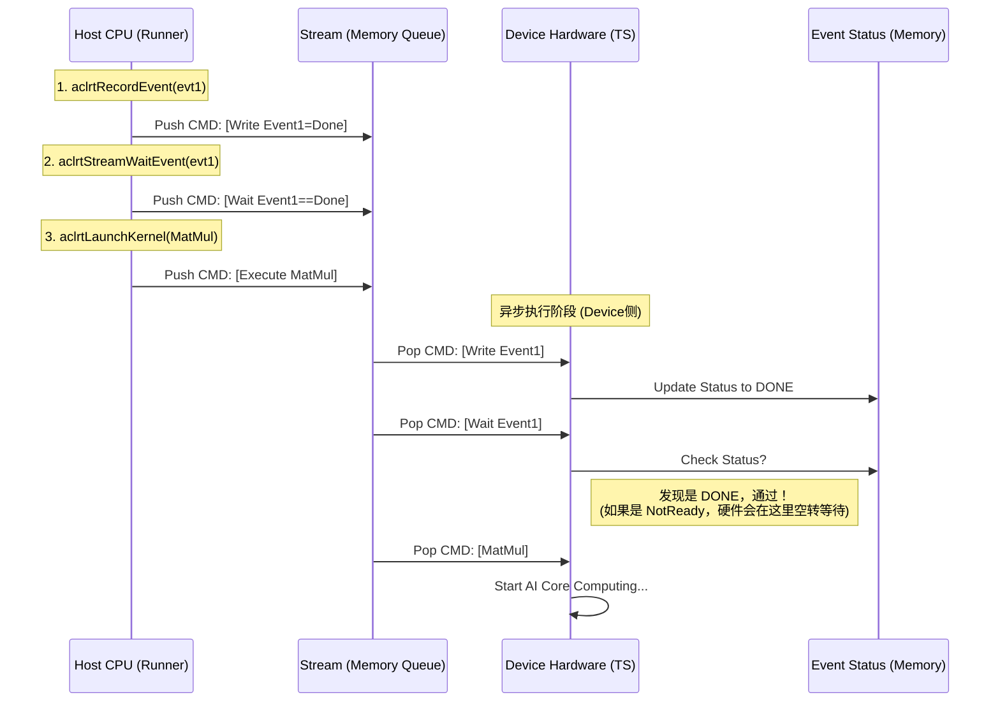
只要是塞进 Stream 里的东西，都是由 Device 硬件执行的。

## Device、Context、Stream 等硬件资源关系建模

Device、Context、Stream 与用户主机线程之间的关系
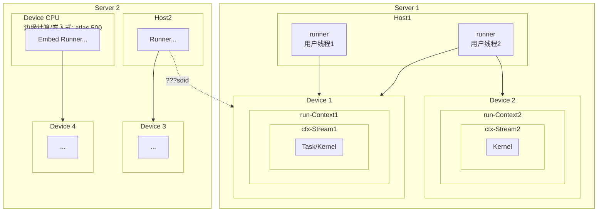

### 基础设备关系建模

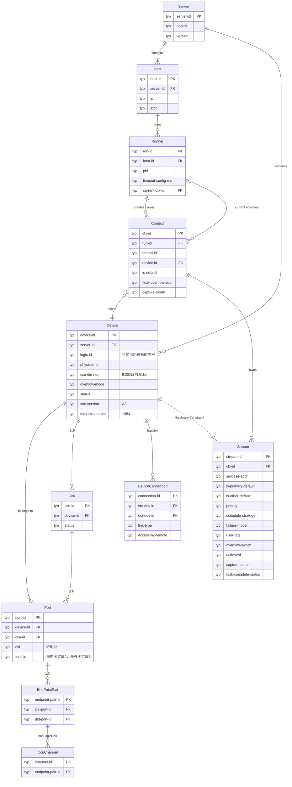
#### 关键关系说明：
|关系	|含义	|说明/注意事项|
|------|--------------|--------------|
|Server → Host|一个Server可能包含多个 Host 实例|比如多路 CPU 或虚拟化环境|
|Server → Device|一个Server包含多个 AI 设备|对应 /dev/davinci0, /dev/davinci1 等|
|Host → Runner|	每个主机上有多个应用线程（Runner）|每个 Runner 可以创建多个 Context|
|Runner → Context|线程创建或切换到不同的 Context|使用 aclrtCreateContext() 和 aclrtSetCurrentContext()|
|Context → Device|Context 绑定 Device|一旦创建后不可跨设备|
|Context → Stream|每个 Context 可创建多个 Stream|对应 aclrtCreateStream()|
|Stream → TaskKernel|Stream 承载推理/算子任务|aclrtLaunchKernel() / aclrtMemcpyAsync()|
|Device ↔ DeviceConnection|设备间通信通道|aclrtDeviceCanAccessPeer(), aclrtDeviceEnablePeerAccess()|
|Runner ↔ Context (current)|当前上下文激活状态|aclrtGetCurrentContext()、aclrtSetCurrentContext()|
|Device .. Stream|资源上限约束关系|Stream 数量受硬件限制（max-stream-cnt）|
|Host ↔ Device|Host 通过驱动与 Device 通信|	逻辑上是 PCIe 或者 HCCS 连接|

#### 配套接口映射表：
##### 基础与设备层 (Device / Server)
| 实体/属性 | 关键API接口 |
|----------- |-------------|
|Server/Host |`aclInit`, `aclFinalize` |
|Runner.pid |`rtDeviceGetBareTgid` |
|Device|`rtGetDeviceCount`  |
|Device.logic-id|`rtSetDevice`,`rtResetDevice`,`rtGetDevice`,`rtsGetLogicDevIdByPhyDevId`|
|Device.physical-id|`rtGetPhyDevIdByLogicDevId`|
|Device.soc-name |`rtGetSocName` |
|Device.overflow-mode|`rtSetDeviceSatMode`,`rtGetDeviceSatMode`|
|DeviceConnection|`rtGetDevicesTopo`,`rtDeviceDisablePeerAccess`,`rtDeviceEnablePeerAccess`,`rtDevicePeerAccessStatus`|
|Context.context-id|`rtCreateContext`,`rtDestroyContext`|
|Context.is-default |`rtSetCurrentContext`,`rtGetCurrentContext`|
|Context.float-overflow-addr |`rtCtxGetFloatOverflowAddr`|
|Stream表|`aclrtGetStreamAvailableNum`|
|Stream.stream-id |`rtCreateStream`,`rtCreateStreamWithConfig`,`rtDestroyStream`,`rtDestroyStreamForce`|
|Stream.task-complete-status |`rtSynchronizeStream`, `rtSynchronizeStreamWithTimeout`|
|Stream.activated |`rtStreamStop`|
|Stream.failure-mode |`rtSetStreamAttribute`,`rtGetStreamAttribute`|

### 基础内存管理关系建模
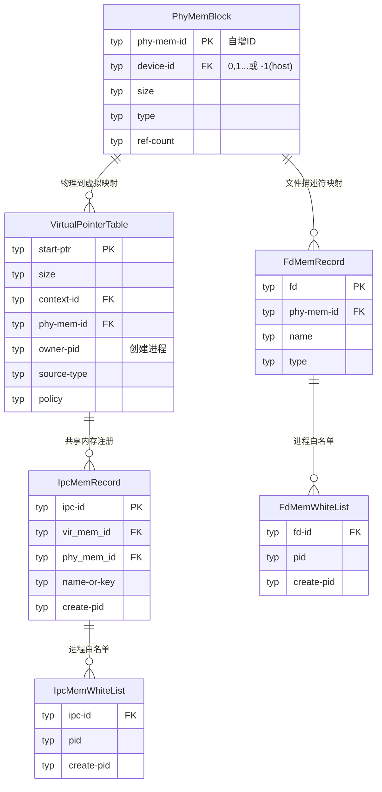
#### 关键关系说明：
1. **物理内存核心地位**  
   `PhyMemBlock`作为基础实体，通过`phy_mem_id`与所有其他实体关联，体现华为昇腾"物理内存池化"的设计理念[3]。

2. **三层映射体系**：
   - 物理→虚拟（`VirtualPointerTable`）
   - 物理→IPC共享（`IpcMemRecord`）
   - 物理→文件描述符（`fdMemRecord`）

3. **安全控制**：
   `IpcMemWhiteList`通过进程PID白名单机制实现华为HCCS（Huawei Collective Communication Service）的安全共享[3]。

4. **特殊映射类型**：
   `MemMapRecord`记录双虚拟地址映射场景（如`aclrtMapMem`产生的映射），支持华为NPU的零拷贝数据传输[3]。

#### 配套接口映射表：
| 实体 | 关键管理接口 |
|--------------|--------------|
|PhyMemBlock|`rtMallocPhysical`, `rtFreePhysical`|
|VirtualPointerTable|`rtMallocWithCfg`,`rtMallocForTaskScheduler`,`rtMallocHostWithCfg`,`rtFree`,`rtReserveMemAddress`,`ReleaseMemAddress`, `rtMapMem`, `rtUnmapMem`|
|VirtualPointerTable.context-id| `rtPointerGetAttributes`|
|FdMemRecord.fd | `rtMemExportToShareableHandle`, `rtMemImportFromShareableHandle`|
|FdMemWhiteList.pid| `rtMemSetPidToShareableHandle`|
|IpcMemRecord.name-or-key| `rtIpcMemGetExportKey` |
|IpcMemRecord.ipc-id|`rtIpcMemImportByKey`,`IpcMemClose` |
|IpcMemWhiteList.pid | `rtIpcMemSetImportPid` |
|MemMapRecord |`rtHostRegister`, `rtHostUnRegister` |

## 在基础模型上扩展数据任务模型

### 数据 / 任务流建模
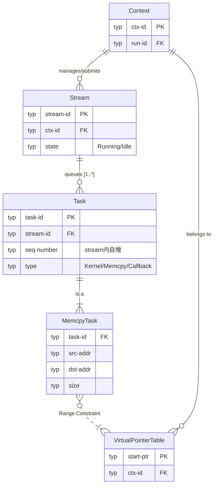
### ccu资源建模
一个NPU device包含2个CCU，分别为die0和die1。

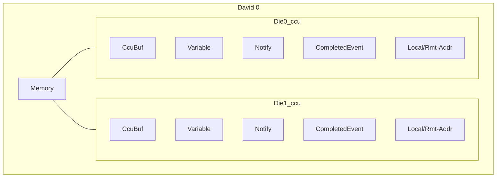

#### 配套接口映射表：
| 实体 | 关键管理接口 |
|------|--------------|
||`xx`, ``|
  
### 异步 / 同步执行建模

#### [Notify资源管理](https://www.hiascend.com/document/detail/zh/CANNCommunityEdition/850alpha001/appdevg/acldevg/aclcppdevg_000524.html)
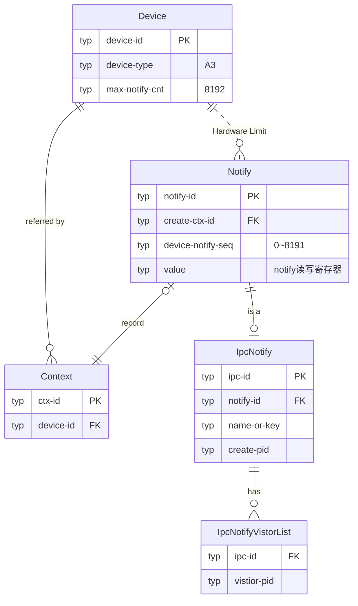
##### 关键关系说明：

##### 配套接口映射表：
| 实体 | 关键管理接口 |
|------|--------------|
|Notify.notify-id |`rtCreateNotify`,`rtDestroyNotify`，`rtGetNotifyId`|
|Notify.state|`lrtWaitAndResetNotify`, `rtWaitAndResetNotify`|
|IpcNotify.name-or-key|`rtNotifyGetExportKey`,`rtNotifyImportByKey`|
|IpcNotifyVistorList.ipc-id|`rtNotifySetImportPid`|

#### Notify同步控制

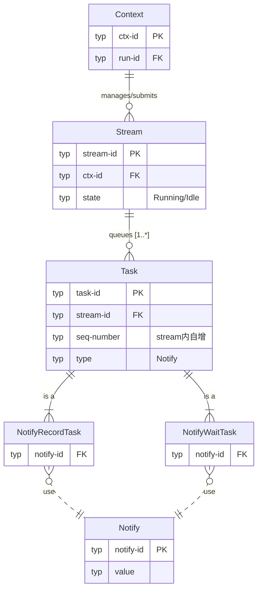
##### 关键关系说明：
##### 配套接口映射表：
| 实体 | 关键管理接口 |
|------|--------------|
|NotifyRecordTask|`rtRecordNotify` |
|NotifyWaitTask|`lrtWaitAndResetNotify`|
#### Event资源管理

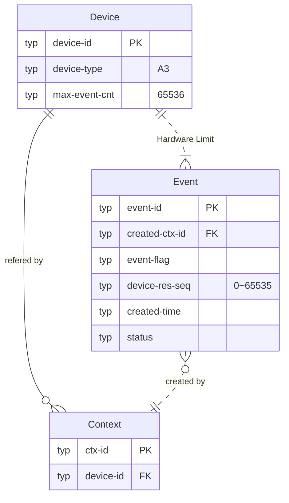

##### 关键关系说明：

##### 配套接口映射表：
| 实体 | 关键管理接口 |
|------|--------------|
| Event.event-id | `rtCreateEvent`, `rtCreateEventWithFlag`,`rtDestroyEvent`,`rtGetEventId`|
| Event.status | `rtRecordEvent`,`rtQueryEventStatus`|
#### Event 流程控制
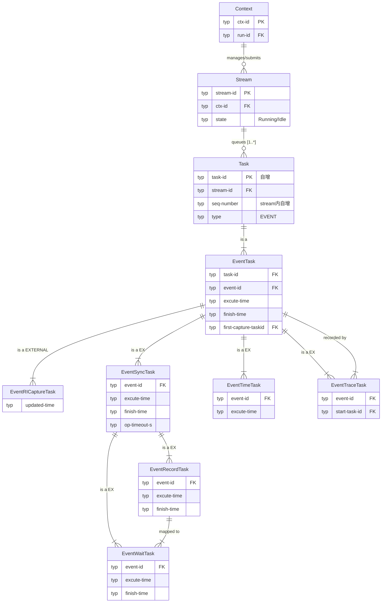
##### 关键关系说明：
##### 配套接口映射表：
| 实体 | 关键管理接口 |
|------|--------------|
| EventTask | `rtRecordEvent`, `rtResetEvent`,`rtSynchronizeEvent`|
| EventRecordTask | `rtRecordEvent`, `rtResetEvent`|
| EventWaitTask | `rtStreamWaitEvent`, `rtQueryEventWaitStatus`|
| EventTimeTask | `rtResetEvent`, `rtRecordEvent` |
| EventTraceTask | `rtResetEvent`, `rtRecordEvent` |

## 通信域建模

跨机通信涉及到多通信域混合任务编排。
通信域的本质是HCCL在框架层通过Rdma_Agent提供的建链能力，维护的一张多卡的网络拓扑，保存在host进程中。

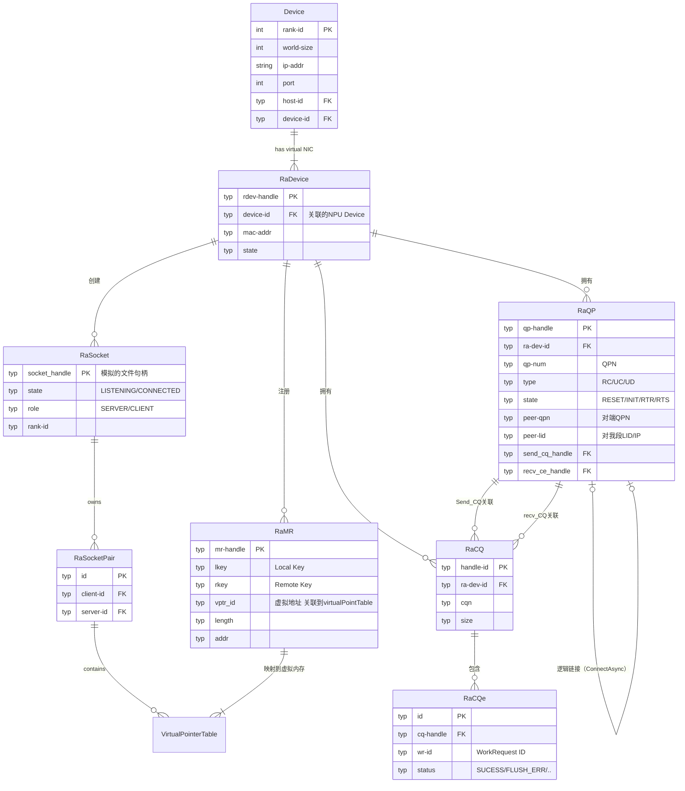

##### 关键关系说明：
我们需要将 RA 模块拆解为两部分：IB Verbs 资源池（用于数据平面）和 Socket 资源池（用于控制平面）。

关键点说明：

RaContext/RaDevice: 模拟一张网卡（RNIC）。
RaQP (Queue Pair): 模拟发送/接收队列，这是 RDMA 通信的核心。
RaCQ (Completion Queue): 模拟完成队列，存放通信结果。
RaMR (Memory Region): 这是连接你现有内存模型的桥梁。它必须关联到你定义的 VirtualPointerTable
##### 配套接口映射表：
| 实体 | 关键管理接口 |
|------|--------------|
|RaDevice | `RaTlvInit`, `RaGetSockets`，`RaRdevInit`|
|ControlSocket|`RaSocketBatchConnect`,`RaSocketListenStart`,`RaSocketSend/Recv`|
|RaMR|`RaMrReg`,`RaRegisterMr`,`RaGetNotifyMrInfo`|
|RqQP | `RaQpCreate`,`RaQpDestroy`,`RaQpModify`,`RaQpConnectAsync`|
|RqCQ  | `RaSendWr`, `RaRecvWrlist`,`RaPollCq`|

## 回调与报告关系建模

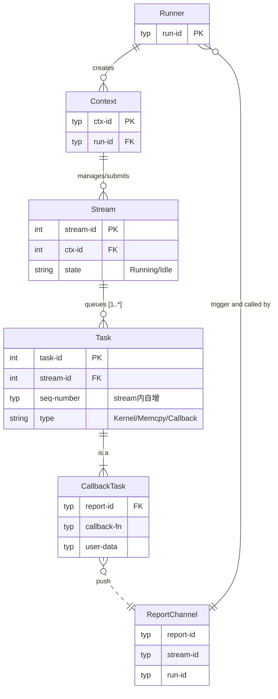

##### 关键关系说明：
==**设备**==执行到 CallbackTask 时，触发 Host Runner 线程执行回调
##### 配套接口映射表：
| 实体 | 关键管理接口 |
|------|--------------|
| CallbackTask | `rtSetExceptionInfoCallback`, `rtLaunchCallback`,`rtSynchronizeEvent`|
| ReportChannel | `rtSubscribeReport`, `rtUnSubscribeReport`|
| Runner | `rtProcessReport`|

## 基础`设备`模型细粒度底层扩展
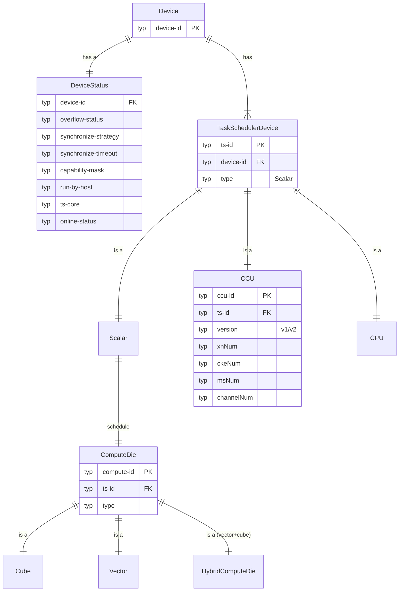
##### 关键关系说明：

##### 配套接口映射表：
| 实体 | 关键管理接口 |
|------|--------------|
| TaskSchedulerDevice | `rtGetDeviceInfo`, `rtSetTsDevice`|
| DeviceStatus      |`rtGetRunMode`     |

## Kernel 运行时关系建模

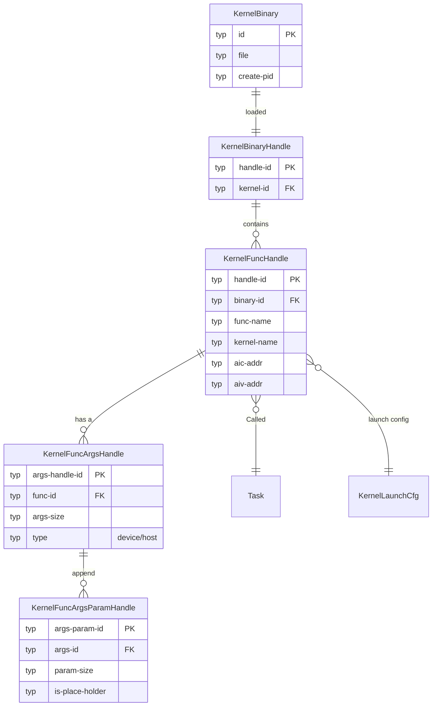
##### 关键关系说明：

##### 配套接口映射表：
| 实体 | 关键管理接口 |
|------|--------------|
| KernelBinary | `rtCreateBinary`, `rtDestroyBinary`|
| KernelBinaryHandle|`rtBinaryLoad`, `rtBinaryUnLoad`,`rtBinaryLoadFromFile`,`rtBinaryLoadFromData`|
| KernelFuncHandle|`rtBinaryGetFunction`, `rtBinaryGetFunctionByEntry`,`rtGetFunctionAddr`,`rtGetFunctionName`,`rtRegisterCpuFunc`|

## 模型加载关系建模

